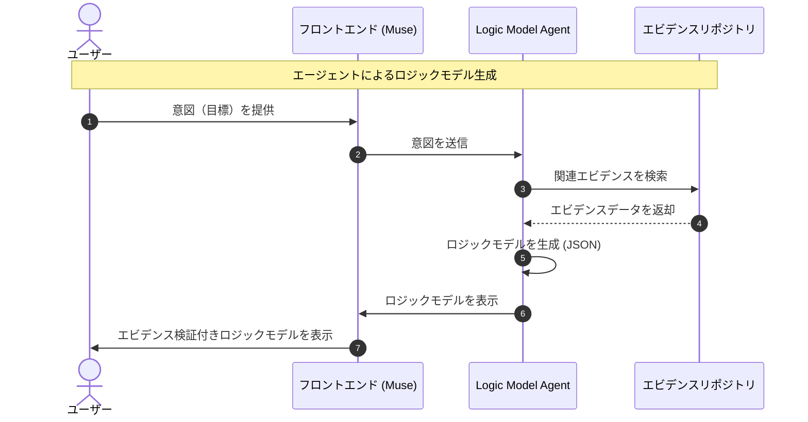
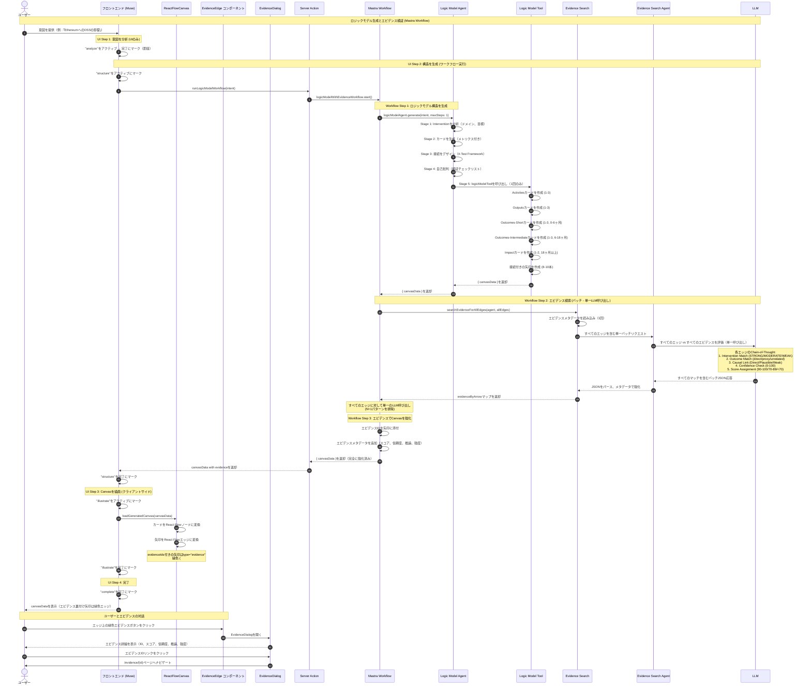

# Muse の流れ

## シーケンス図



## ロジックモデル検証のためのエビデンス検索

### 機能概要

Museは、ロジックモデル内の因果関係を裏付ける研究エビデンスを検索することで、自動的に検証を行います。Logic Model Agentがカードを接続するエッジ（矢印）を生成する際、ローカルのエビデンスリポジトリから、その関係性を裏付ける研究を検索します。

**主な機能:**

- **自動検証**: エビデンス検索はロジックモデル生成時に実行される
- **LLMベースのマッチング**: Chain-of-thought推論を使用して、エビデンスのintervention→outcome関係とロジックモデルのエッジを意味的にマッチング
- **品質指標**: エビデンス強度評価（Maryland Scientific Method Scale 0-5）を表示し、低品質エビデンスに警告を表示
- **エビデンスメタデータ**: 各エッジにマッチしたエビデンスID、スコア、信頼度評価、構造化された推論を保存

### 仕組み

1. **ロジックモデル生成**: エージェントが検証チェックポイントを持つ5段階の構造化ワークフローを使用して、カード（Activities → Outputs → Outcomes-Short → Outcomes-Intermediate → Impact）とそれらを接続する矢印を作成
2. **エビデンス検索**: すべての矢印に対して、Evidence Search Agentへの**単一のバッチリクエスト**としてエビデンス検索を実行（1回のLLM呼び出しですべてのエッジを評価）
3. **セマンティックマッチング**: Evidence Search Agent（google/gemini-2.5-pro使用）がchain-of-thought推論を使用して、エビデンスのintervention→outcomeペアがエッジ関係を裏付けるかを評価
4. **エビデンス添付**: スコア≥70の上位マッチングエビデンスIDを、メタデータ（スコア、信頼度、推論、強度、intervention/outcomeテキスト）と共に矢印に添付
5. **UI表示**: フロントエンドは、エビデンス付きの矢印を緑色の太いエッジとして、インタラクティブなボタンと共にレンダリング。クリックすると、エビデンスページへのクリック可能なリンクを含む完全なエビデンス詳細が表示されるダイアログが開く

**UIフロー**: ユーザーには4つのステップ（analyze → structure → illustrate → complete）が表示されるが、完全な3ステップワークフロー（構造生成 → エビデンス検索 → 強化）は「structure」ステップ中に見えない形で実行される

### 詳細シーケンス図



### エビデンスマッチングの例

**ロジックモデルのエッジ:**

- Card A (Activity): "OSS貢献者向けGitHub Sponsorsプログラムを展開"
- Card B (Output): "スポンサー付き開発者からのプルリクエスト提出が増加"

**エビデンスマッチ:**

```yaml
evidence_id: "05"
title: "The Effect of Rewards on Developer Contributions"
results:
  - intervention: "Listing individual OSS contributors on GitHub Sponsors"
    outcome_variable: "Submitting Pull Requests (PRs)"
    outcome: "+"
strength: 4 (Maryland Scale)
```

**LLM評価（Chain-of-Thought推論）:**

1. **Intervention Match**: STRONG - 同じ概念（GitHub Sponsorsプログラム）
2. **Outcome Match**: STRONG - 直接的な測定（PR提出）
3. **Causal Link**: Direct - スポンサーシップのインセンティブが直接的にPR活動の増加を引き起こす
4. **Confidence**: 95/100 - 高い確実性、確立された関係性
5. **Final Score**: 92/100 (STRONG match)
6. **Reasoning**: "Intervention Match: STRONG - 同じ概念（GitHub Sponsors）。Outcome Match: STRONG - 直接的な測定（PR提出）。Causal Link: Direct - スポンサーシップが貢献を直接的にインセンティブ化。"

### エビデンス検索の哲学

**包括的検索と現実的な期待**

エビデンス検索ツールは、**ロジックモデル内のすべての矢印**に対して裏付けエビデンスを検索しますが、限定されたリポジトリ（約21のエビデンスファイル）からは、ほとんどの関係性に対してマッチするエビデンスが見つからないことを受け入れています。これは自然で、予想され、科学的に価値があることです。

**すべてを検索する理由:**

1. **完全な透明性**: ユーザーは、エビデンスの全体像を見ることができる - どの関係性がエビデンスに裏付けられており、どれが理論的仮定なのか
2. **研究ギャップの特定**: エビデンスのないエッジは、将来の研究とエビデンス収集の機会を浮き彫りにする
3. **信頼の構築**: エビデンス基盤について正直であることは、選択的な提示よりも信頼性を強化する
4. **機会の見逃しを防ぐ**: 予想外に裏付けエビデンスがあるエッジをスキップしないことを保証

**期待される結果:**

- **典型的なカバレッジ**: 10-15本の総エッジのうち2-4本のエッジに裏付けエビデンスがある可能性
- **エビデンスギャップは正常**: ほとんどのロジックモデル関係性は、理論的またはドメイン知識に基づくものであり、直接的な研究エビデンスではない
- **高価値マッチ**: エビデンスが見つかった場合、それはその特定の因果主張を大幅に強化する

**UIプレゼンテーション:**

- エビデンス付きの矢印は緑色の太いエッジで表示（マッチスコア≥70）
- エッジの中点にインタラクティブな緑色ボタンでエビデンス詳細にアクセス
- エビデンスカバレッジは色分けで自然に可視化（緑 vs グレーのエッジ）
- エビデンスのないエッジは通常のグレーカーブとして表示（ネガティブな表示なし）
- クリック可能なエビデンスIDリンクが`/evidence/{id}`ページへのダイアログインターフェース
- 色とインタラクティビティを通じて、エビデンスに裏付けられた関係性にユーザーの注意を集中

**科学的利点:**

このアプローチにより、Museのロジックモデルはより厳密で正直になります。以下を明確に区別します:

- **エビデンスに裏付けられた主張**（高い信頼性） ✅
- **理論的仮定**（検証が必要） 🔬
- **研究機会**（埋めるべきエビデンスギャップ） 📊

### 技術実装

**エージェントアーキテクチャと品質管理:**

システムは、包括的な品質管理を備えた2つの専門AIエージェントを使用します:

**1. Logic Model Agent** (`mastra/agents/logic-model-agent.ts`)

構造化された5段階ワークフローを持つTheory of Change専門家:

- **Stage 1: Interventionを分析**
  - ドメイン分析（tech、education、health、civic）
  - ターゲット母集団の特定
  - 目標評価と参照介入

- **Stage 2: カードを生成**
  - ステージごとに1-2枚のカードを作成、タイトル（最大100文字）、説明（最大200文字）、メトリクス付き
  - ステージ: Activities → Outputs → Outcomes-Short（0-6ヶ月） → Outcomes-Intermediate（6-18ヶ月） → Impact（18ヶ月以上）
  - 各カードにはname、measurementMethod、frequencyフィールドを持つ1つのメトリクスオブジェクトが必要

- **Stage 3: 4-Test Frameworkで接続をデザイン**
  - **Directness Test**: 明確で即座の因果経路（1-2ステップ）
  - **Expert Test**: ドメイン専門家はこれがもっともらしいと同意するか？
  - **Timeframe Test**: ステージの時間枠内で結果を達成可能か？
  - **Mechanism Test**: XがどのようにYを引き起こすかを明確に説明できるか？
  - 接続境界: 8-10が理想、25が絶対最大
  - カードごとの制限: 1-2本の出力接続（最大3本）

- **Stage 4: 自己批判**
  - **フォーマット検証チェックリスト**: targetContextは文字列、メトリクスはオブジェクト、文字数制限
  - **ロジック検証チェックリスト**: ステージジャンプなし、現実的な時間枠、循環依存なし
  - **メタ認知的質問**: 「専門家はこれを疑問視するか？」、「過度に楽観的か？」、「接続数を水増ししたか？」

- **Stage 5: ツールを呼び出し**
  - 検証済み構造でcanvasを生成
  - ツールは正確に1回だけ呼び出される必要がある（maxSteps: 1）

**よくある間違いの防止:**

- ❌ 最大の間違い #1: targetContextをオブジェクトとして渡す（文字列ではなく）
- ❌ 最大の間違い #2: メトリクスを文字列として渡す（オブジェクトではなく）
- ❌ 最大の間違い #3: 接続が多すぎる（>15）または少なすぎる（<8）
- ❌ 最大の間違い #4: カウントを満たすために弱い/間接的な接続を作成
- ❌ 最大の間違い #5: 無効なfrequency値

**2. Evidence Search Agent** (`mastra/agents/evidence-search-agent.ts`)

Chain-of-thought推論を備えたLLMベースのエビデンスマッチング:

- **バッチモード**: 単一のLLM呼び出しですべてのエッジを評価
- **構造化推論**（5つのサブステージ）:
  1. **Intervention Match Analysis**: アライメントを評価（STRONG/MODERATE/WEAK/NONE）
  2. **Outcome Match Analysis**: 直接的測定、代理測定、または無関係
  3. **Causal Link Assessment**: Direct、Plausible、Weak、または接続なし
  4. **Confidence Check**: 0-100の確実性と代替解釈
  5. **Final Score Assignment**: 90-100（STRONG）、70-89（MODERATE）、<70（除外）

**スコアリング校正例:**

- **スコア95（STRONG）**: 同じ概念、直接的な因果リンク、高い信頼度
- **スコア75（MODERATE）**: 関連する概念、もっともらしい因果リンク、中程度の信頼度
- **スコア60（WEAK - 除外）**: 間接的または弱い接続、低い信頼度

**境界線処理（65-75）:**

- より保守的な基準を使用して再評価
- 質問: ドメイン専門家は同意するか？
- 信頼度を確認: <60の場合、除外を検討
- 疑わしい場合は除外する側に誤る
- 推論の不確実性を文書化

**出力フォーマット:**

```json
{
  "results": {
    "arrowId1": [
      {
        "evidenceId": "00",
        "score": 95,
        "confidence": 90,
        "reasoning": "Intervention Match: STRONG - ...",
        "interventionText": "...",
        "outcomeText": "..."
      }
    ]
  }
}
```

**検証チェックリスト:**

- ✓ すべてのarrowIdが存在（空配列でも）
- ✓ スコア≥70のマッチのみが含まれる
- ✓ 6つの必須フィールドすべてが存在: evidenceId、score、confidence、reasoning、interventionText、outcomeText
- ✓ 推論は構造化フォーマットに従う
- ✓ 信頼度値が入力されている（0-100）
- ✓ JSONフォーマットがスキーマと完全に一致

**コアコンポーネント:**

- `components/canvas/GenerateLogicModelDialog.tsx`: 4ステッププロセスのメインUIコンポーネント
  - Step 1: "analyze" - 即座のUI専用ステップ
  - Step 2: "structure" - サーバーアクションを呼び出し、すべてのワークフローステップがここで実行される
  - Step 3: "illustrate" - `loadGeneratedCanvas()`でクライアントサイドレンダリング
  - Step 4: "complete" - 最終状態
  - Zodでフォーム検証、デフォルトintent例を提供

- `app/actions/canvas/runWorkflow.ts`: ワークフロー実行のためのサーバーアクションラッパー
  - `runLogicModelWorkflow(intent)`: Mastraワークフローを実行、簡略化された結果（canvasDataのみ）を返す
  - 正しいパス解決のためにPROJECT_ROOT環境変数を設定
  - CanvasDataSchemaで出力を検証
  - 成功時は`{ success: true, canvasData }`、失敗時は`{ success: false, error }`を返す

- `mastra/workflows/logic-model-with-evidence.ts`: 3ステップのプロダクションワークフロー:

  **Step 1: ロジックモデル構造を生成**
  - ツール検証エラーのリトライロジックを含む（メトリクスフォーマット失敗時に自動的により厳格なプロンプトで再試行）
  - エージェントがlogicModelToolを呼び出し、有効なcanvasDataを返したことを検証
  - 詳細なロギングでツール結果からcanvasDataを抽出

  **Step 2: バッチエビデンス検索**
  - 高速検索のためにカードIDをコンテンツにマッピング
  - バッチ処理のためにすべてのエッジを準備（無効な矢印をフィルタ）
  - `searchEvidenceForAllEdges`への単一バッチ呼び出し
  - すべての矢印にエビデンスエントリがあることを保証（マッチがない場合は空配列）

  **Step 3: エビデンスでCanvasを強化**
  - エビデンスマッチを矢印IDにマッピング
  - evidenceIdsとevidenceMetadataを矢印に添付
  - 強化されたcanvasDataを返す

  簡略化された出力を返す: `{ canvasData }`（統計はデータから導出、別途追跡なし）
  モジュールプレフィックスと詳細なデバッグ情報を含む包括的なロギング

- `lib/evidence-search-batch.ts`: バッチエビデンス検索関数
  - すべてのエッジに対して単一のLLM呼び出し（N+1パターンを排除）
  - エビデンスメタデータを1回読み込み、すべてのマッチを強化
  - `Record<arrowId, EvidenceMatch[]>`マップを返す
  - エラー処理は失敗時にすべてのエッジに対して空の結果を返す

- `mastra/tools/logic-model-tool.ts`: ロジックモデル構造生成のためのツール
  - 入力フォーマットを検証（targetContext、metrics、connections）
  - 配置を含むcanvasレイアウトを生成
  - スキーマに準拠したCanvasDataを返す

- `types/index.ts`: 型定義
  - `evidenceIds: string[]`と`evidenceMetadata: EvidenceMatch[]`で拡張されたArrow型
  - evidenceId、score、confidence、reasoning、strength、hasWarning、title、interventionText、outcomeTextを含むEvidenceMatchインターフェース
  - 検証のために全体で再利用されるCanvasDataSchema

**アーキテクチャの利点:**

- **関心の分離**: 構造生成とエビデンス検索を分離（3つの異なるワークフローステップ）
- **ステップバイステップUI**: ユーザーは4つのUIステップで明確な進捗を確認（analyze → structure → illustrate → complete）
- **バッチ処理**: 単一のLLM呼び出しですべてのエッジを評価、N+1パターンを排除
- **高速モデル**: ツール呼び出しサポート付きの高品質LLM評価に`google/gemini-2.5-pro`を使用
- **構造化されたエージェント指示**: 品質保証のための検証チェックリストとメタ認知的質問を含む5段階ワークフロー
- **接続品質フレームワーク**: 4-Test検証（Directness、Expert、Timeframe、Mechanism）により強力な因果リンクのみを保証
- **Chain-of-Thought推論**: エビデンス検索は透明な意思決定のために構造化分析を使用
- **リトライロジック**: 最初の試行でツール検証が失敗した場合、より厳格なプロンプトで自動的に再試行
- **簡素化されたAPI**: CanvasDataのみを返し、消費者は必要に応じて統計を計算（重複追跡なし）
- **環境認識**: PROJECT_ROOT処理により、すべてのコンテキスト（dev、build、Next.js）で正しいファイルパスを保証
- **プロダクション対応ロギング**: モジュールプレフィックスと包括的なデバッグ情報を含む詳細な進捗ログ
- **スキーマ再利用**: `types/index.ts`から100%の型再利用（CanvasDataSchema、EvidenceMatchSchemaなど）
- **透明なエビデンス検索**: エビデンス検索は構造ステップ中に見えない形で実行、別のUI読み込み状態なし
- **より良いエラー回復**: リトライロジックがフォーマットエラーをキャッチ、詳細なロギングがデバッグを支援
- **可観測性**: 構造化推論を含む包括的なロギングにより、エージェントの決定を説明可能に

**環境設定:**

- `PROJECT_ROOT`環境変数により、Mastraがコードをバンドルする際に正しいファイルパスを保証
- `package.json`スクリプトで自動的に設定:
  - `"dev:mastra": "PROJECT_ROOT=$(pwd) mastra dev --dir mastra"`
  - `"build:mastra": "PROJECT_ROOT=$(pwd) mastra build --dir mastra"`
- サーバーアクション（`app/actions/canvas/runWorkflow.ts`）のフォールバックにより、Next.jsコンテキストで動作することを保証
- **必要な理由**: Mastraがコードをバンドルして実行する際、`process.cwd()`はプロジェクトルートではなく`.mastra/output/`を指す
- **解決策**: `lib/evidence.ts`はパス解決に`process.env.PROJECT_ROOT || process.cwd()`を使用
- `contents/evidence/`からエビデンスファイルを読み込む際の`ENOENT`エラーを解決

**UIフロー（4ステップ）:**

1. **Analyze Intent**（UIのみ） - ステップをアクティブ → 即座に完了にマーク
2. **Generate Structure**（サーバー） - **完全なワークフローがここで実行**:
   - Workflow Step 1: 5段階検証付きでカードと矢印をLLMが生成
   - Workflow Step 2: バッチエビデンス検索 - すべてのエッジに対してchain-of-thought付き単一LLM呼び出し
   - Workflow Step 3: エビデンスメタデータで矢印を強化
3. **Illustrate Canvas**（クライアント） - React FlowでcanvasDataをレンダリング、エビデンススタイリングを適用
4. **Complete**（UI） - エビデンス裏付け矢印用の緑色エッジを含む最終ロジックモデルを表示

**フロントエンドコンポーネント:**

- `components/canvas/EvidenceEdge.tsx`: ボタンツールバー付きのカスタムReact Flowエッジ
  - スムーズな曲線エッジのために`getBezierPath`を使用
  - `EdgeLabelRenderer`を使用してエッジの中点に緑色ボタンをレンダリング
  - ダイアログの開閉状態を管理

- `components/canvas/EvidenceDialog.tsx`: エビデンス表示用のモーダルダイアログ
  - エビデンスIDを`/evidence/{id}`ページへのリンクとして表示
  - 関連性スコア、信頼度評価、推論、強度評価を表示
  - intervention/outcomeテキストと品質警告を含む

- `components/canvas/ReactFlowCanvas.tsx`: カスタムエッジタイプ登録付きのCanvas
  - `edgeTypes: { evidence: EvidenceEdge }`をマッピング
  - `arrowsToEdges()`を介してエビデンススタイリングを自動的に適用

- `lib/canvas/react-flow-utils.ts`: エッジタイプ検出とスタイリング
  - `evidenceIds`を持つ矢印に`type: "evidence"`を設定
  - 緑色の太いスタイリングを適用（`#10b981`、3px strokeWidth）

**エビデンス品質スケール（Maryland Scientific Method Scale）:**

- 5: ランダム化比較試験（RCT）
- 4: 強力なデザインの準実験
- 3: 弱いデザインの準実験
- 2: 相関研究
- 1: 前実験
- 0: 不明確/報告されていない

**UI実装:**

- **緑色の太いエッジ**: エビデンス付きの矢印はエメラルドグリーン（#10b981）、3px太さのベジエ曲線として表示
- **エビデンスボタン**: エッジの中点にFileTextアイコン付きの緑色の円形ボタン（エビデンス付きエッジのみ）
- **エビデンスダイアログ**: ボタンクリック時に詳細なエビデンスメタデータを表示するモーダル
  - エビデンスID（`/evidence/{id}`へのクリック可能なリンク）
  - 関連性スコア（0-100）と色分けされたバッジ
  - 信頼度評価（0-100）
  - タイトル、推論、強度評価（0-5）
  - InterventionとOutcomeテキスト
  - エビデンス強度 < 3の場合の⚠️警告インジケータ
- **クリーンなデザイン**: カードにバッジなし、エビデンス情報はエッジのみに表示
