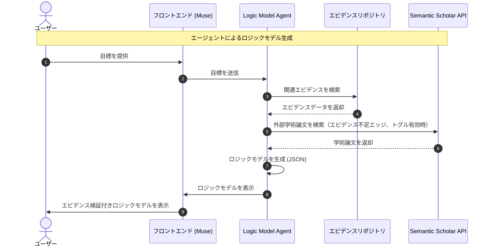
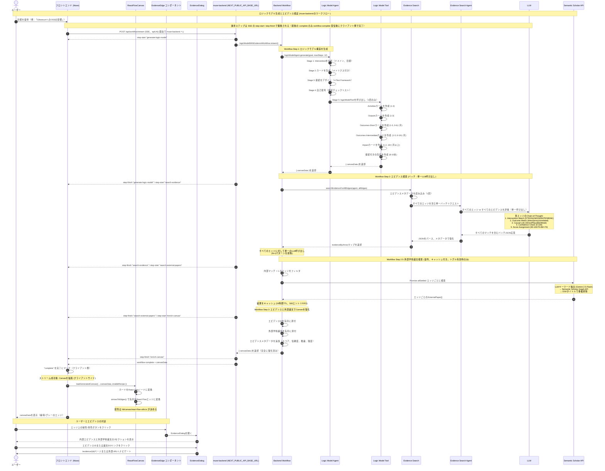

# Muse の流れ

## シーケンス図


```mermaid
sequenceDiagram
    autonumber
    actor User as ユーザー
    participant FE as フロントエンド (Muse)
    participant Agent as Logic Model Agent
    participant Evidence as エビデンスリポジトリ
    participant SS as Semantic Scholar API

    Note over User, SS: エージェントによるロジックモデル生成

    User->>FE: 目標を提供
    FE->>Agent: 目標を送信
    Agent->>Evidence: 関連エビデンスを検索
    Evidence-->>Agent: エビデンスデータを返却
    Agent->>SS: 外部学術論文を検索（エビデンス不足エッジ、トグル有効時）
    SS-->>Agent: 学術論文を返却
    Agent->>Agent: ロジックモデルを生成 (JSON)
    Agent->>FE: ロジックモデルを表示
    FE->>User: エビデンス検証付きロジックモデルを表示
```

## ロジックモデル検証のためのエビデンス検索

### 機能概要

Museは、ロジックモデル内の因果関係を裏付ける研究エビデンスを検索することで、自動的に検証を行います。Logic Model Agentがカードを接続するエッジ（矢印）を生成する際、ローカルのエビデンスリポジトリから、その関係性を裏付ける研究を検索します。

**主な機能:**

- **自動検証**: エビデンス検索はロジックモデル生成時に実行される
- **LLMベースのマッチング**: Chain-of-thought推論を使用して、エビデンスのintervention→outcome関係とロジックモデルのエッジを意味的にマッチング
- **品質指標**: エビデンス強度評価（Maryland Scientific Method Scale 0-5）を表示し、低品質エビデンスに警告を表示
- **エビデンスメタデータ**: 各エッジにマッチしたエビデンスID、スコア、信頼度評価、構造化された推論を保存
- **外部学術論文検索**: 内部エビデンスが不足するエッジに対して、Semantic Scholar APIから関連する学術論文を検索（参考資料として表示）。生成ダイアログのトグルで有効にしたときだけ実行される

### 仕組み

1. **ロジックモデル生成**: エージェントが検証チェックポイントを持つ5段階の構造化ワークフローを使用して、カード（Activities → Outputs → Outcomes-Short → Outcomes-Intermediate → Impact）とそれらを接続する矢印を作成
2. **エビデンス検索**: すべての矢印に対して、Evidence Search Agentへの**単一のバッチリクエスト**としてエビデンス検索を実行（1回のLLM呼び出しですべてのエッジを評価）
3. **セマンティックマッチング**: Evidence Search Agent（google/gemini-2.5-pro使用）がchain-of-thought推論を使用して、エビデンスのintervention→outcomeペアがエッジ関係を裏付けるかを評価
4. **エビデンス添付**: スコア≥70の上位マッチングエビデンスIDを、メタデータ（スコア、信頼度、推論、強度、intervention/outcomeテキスト）と共に矢印に添付
5. **外部論文検索**: 外部検索トグルが有効なとき、内部エビデンスマッチが不足するエッジに対して、Semantic Scholar APIで学術論文を並列検索。LLM（Gemini 2.5 Flash）がカードタイトルから英語の学術キーワードを抽出し、結果をキャッシュ（24時間TTL）
6. **UI表示**: フロントエンドは、エビデンスの有無に応じてエッジを色分けし、エッジ上のボタンからエビデンスダイアログを開く（配色とダイアログの構成は後述の「フロントエンドコンポーネント」を参照）

**UIフロー**: 生成ダイアログの進捗ステップは、バックエンドが送る SSE の `step-start` / `step-finish` / `step-error` イベントで進む。ステップ ID はバックエンドが送るものをそのまま使い、UI 側で別名を付けることはない。最後の `complete` だけは `workflow-complete` を受け取ったフロントエンドが完了にする。

### 詳細シーケンス図


```mermaid
sequenceDiagram
    autonumber
    actor User as ユーザー
    participant FE as フロントエンド (Muse)
    participant Canvas as ReactFlowCanvas
    participant Edge as EvidenceEdge コンポーネント
    participant Dialog as EvidenceDialog
    participant API as muse-backend (NEXT_PUBLIC_API_BASE_URL)
    participant Workflow as Backend Workflow
    participant Agent as Logic Model Agent
    participant Tool as Logic Model Tool
    participant Search as Evidence Search
    participant EvidenceAgent as Evidence Search Agent
    participant LLM
    participant SS as Semantic Scholar API

    Note over User, SS: ロジックモデル生成とエビデンス検証 (muse-backend のワークフロー)

    User->>FE: 目標を提供（例：「EthereumへのOSSの影響」）

    Note over FE, LLM: 進捗ステップは SSE の step-start / step-finish で駆動される（最後の complete のみ workflow-complete 受信後にクライアント側で完了）
    FE->>API: POST /api/workflow/stream (SSE、apiUrl() 経由で muse-backend へ)
    API-->>FE: step-start "generate-logic-model"
    API->>Workflow: logicModelWithEvidenceWorkflow.stream()

    Note over Workflow, Agent: Workflow Step 1: ロジックモデル構造を生成
    Workflow->>Agent: logicModelAgent.generate(goal, maxSteps: 12)
    Agent->>Agent: Stage 1: Interventionを分析（ドメイン、目標）
    Agent->>Agent: Stage 2: カードを生成（メトリクス付き）
    Agent->>Agent: Stage 3: 接続をデザイン（4-Test Framework）
    Agent->>Agent: Stage 4: 自己批判（検証チェックリスト）
    Agent->>Tool: Stage 5: logicModelToolを呼び出し（1回のみ）
    Tool->>Tool: Activitiesカードを作成 (1-3)
    Tool->>Tool: Outputsカードを作成 (1-3)
    Tool->>Tool: Outcomes-Shortカードを作成 (1-3, 0-6ヶ月)
    Tool->>Tool: Outcomes-Intermediateカードを作成 (1-3, 6-18ヶ月)
    Tool->>Tool: Impactカードを作成 (1-2, 18ヶ月以上)
    Tool->>Tool: 接続付きの矢印を作成 (8-10本)
    Tool-->>Agent: { canvasData }を返却
    Agent-->>Workflow: { canvasData }を返却

    Note over Workflow, LLM: Workflow Step 2: エビデンス検索 (バッチ - 単一LLM呼び出し)
    API-->>FE: step-finish "generate-logic-model" / step-start "search-evidence"
    Workflow->>Search: searchEvidenceForAllEdges(agent, allEdges)
    Search->>Search: エビデンスメタデータを読み込み（1回）
    Search->>EvidenceAgent: すべてのエッジを含む単一バッチリクエスト
    EvidenceAgent->>LLM: すべてのエッジ vs すべてのエビデンスを評価（単一呼び出し）
    Note over LLM: 各エッジのChain-of-Thought:<br/>1. Intervention Match (STRONG/MODERATE/WEAK)<br/>2. Outcome Match (direct/proxy/unrelated)<br/>3. Causal Link (Direct/Plausible/Weak)<br/>4. Confidence Check (0-100)<br/>5. Score Assignment (90-100/70-89/<70)
    LLM-->>EvidenceAgent: すべてのマッチを含むバッチJSON応答
    EvidenceAgent-->>Search: JSONをパース、メタデータで強化
    Search-->>Workflow: evidenceByArrowマップを返却
    Note over Workflow: すべてのエッジに対して単一のLLM呼び出し<br/>(N+1パターンを排除)

    Note over Workflow, SS: Workflow Step 2.5: 外部学術論文検索 (並列、キャッシュ付き。トグル有効時のみ)
    API-->>FE: step-finish "search-evidence" / step-start "search-external-papers"
    Workflow->>Workflow: 内部マッチ < 1 のエッジをフィルタ
    Workflow->>SS: Promise.allSettled: エッジごとに検索
    Note over SS: LLMキーワード抽出 (Gemini 2.5 Flash)<br/>→ Semantic Scholar Graph API<br/>→ DOI/タイトルで重複排除
    SS-->>Workflow: エッジごとのExternalPaper[]
    Note over Workflow: 結果をキャッシュ (24時間TTL、500エントリFIFO)

    Note over Workflow: Workflow Step 3: エビデンスと外部論文でCanvasを強化
    API-->>FE: step-finish "search-external-papers" / step-start "enrich-canvas"
    Workflow->>Workflow: エビデンスIDを矢印に添付
    Workflow->>Workflow: 外部学術論文を矢印に添付
    Workflow->>Workflow: エビデンスメタデータを追加（スコア、信頼度、推論、強度）
    Workflow-->>API: { canvasData }を返却（完全に強化済み）
    API-->>FE: step-finish "enrich-canvas"
    API-->>FE: workflow-complete + canvasData
    FE->>FE: "complete" を完了にマーク（クライアント側）

    Note over FE: ストリーム成功後: Canvasを描画 (クライアントサイド)
    FE->>Canvas: loadGeneratedCanvas({ ...canvasData, enableRecipe })
    Canvas->>Canvas: カードをReact Flowノードに変換
    Canvas->>Canvas: arrowsToEdges() で矢印をReact Flowエッジに変換
    Note over Canvas: 配色は lib/canvas/react-flow-utils.ts が決める
    FE-->>User: canvasDataを表示（緑/青/グレーのエッジ）

    Note over User, Edge: ユーザーとエビデンスの対話
    User->>Edge: エッジ上の緑色/青色ボタンをクリック
    Edge->>Dialog: EvidenceDialogを開く
    Dialog-->>User: 内部エビデンスと外部学術論文の2セクションを表示
    User->>Dialog: エビデンスIDまたは論文DOIリンクをクリック
    Dialog->>User: /evidence/{id}ページまたは外部URLへナビゲート
```

### エビデンスマッチングの例

**ロジックモデルのエッジ:**

- Card A (Activity): "OSS貢献者向けGitHub Sponsorsプログラムを展開"
- Card B (Output): "スポンサー付き開発者からのプルリクエスト提出が増加"

**エビデンスマッチ:**

```yaml
evidence_id: "05"
title: "The Effect of Rewards on Developer Contributions"
results:
  - intervention: "Listing individual OSS contributors on GitHub Sponsors"
    outcome_variable: "Submitting Pull Requests (PRs)"
    outcome: "+"
strength: 4 (Maryland Scale)
```

**LLM評価（Chain-of-Thought推論）:**

1. **Intervention Match**: STRONG - 同じ概念（GitHub Sponsorsプログラム）
2. **Outcome Match**: STRONG - 直接的な測定（PR提出）
3. **Causal Link**: Direct - スポンサーシップのインセンティブが直接的にPR活動の増加を引き起こす
4. **Confidence**: 95/100 - 高い確実性、確立された関係性
5. **Final Score**: 92/100 (STRONG match)
6. **Reasoning**: "Intervention Match: STRONG - 同じ概念（GitHub Sponsors）。Outcome Match: STRONG - 直接的な測定（PR提出）。Causal Link: Direct - スポンサーシップが貢献を直接的にインセンティブ化。"

### エビデンス検索の哲学

**包括的検索と現実的な期待**

エビデンス検索ツールは、**ロジックモデル内のすべての矢印**に対して裏付けエビデンスを検索しますが、限定されたリポジトリ（約21のエビデンスファイル）からは、ほとんどの関係性に対してマッチするエビデンスが見つからないことを受け入れています。これは自然で、予想され、科学的に価値があることです。

**すべてを検索する理由:**

1. **完全な透明性**: ユーザーは、エビデンスの全体像を見ることができる - どの関係性がエビデンスに裏付けられており、どれが理論的仮定なのか
2. **研究ギャップの特定**: エビデンスのないエッジは、将来の研究とエビデンス収集の機会を浮き彫りにする
3. **信頼の構築**: エビデンス基盤について正直であることは、選択的な提示よりも信頼性を強化する
4. **機会の見逃しを防ぐ**: 予想外に裏付けエビデンスがあるエッジをスキップしないことを保証

**期待される結果:**

- **典型的なカバレッジ**: 10-15本の総エッジのうち2-4本のエッジに裏付けエビデンスがある可能性
- **エビデンスギャップは正常**: ほとんどのロジックモデル関係性は、理論的またはドメイン知識に基づくものであり、直接的な研究エビデンスではない
- **高価値マッチ**: エビデンスが見つかった場合、それはその特定の因果主張を大幅に強化する

**UIプレゼンテーション:**

エビデンスのないエッジは通常のグレーカーブとして表示し、欠落を責めるような表示はしません。
3色の色分け（緑 / 青 / グレー）だけでエビデンスカバレッジが一目で読み取れます。
具体的な配色とダイアログの構成は、後述の「フロントエンドコンポーネント」で定義します。

**科学的利点:**

このアプローチにより、Museのロジックモデルはより厳密で正直になります。以下を明確に区別します:

- **エビデンスに裏付けられた主張**（高い信頼性） ✅
- **理論的仮定**（検証が必要） 🔬
- **研究機会**（埋めるべきエビデンスギャップ） 📊

### 技術実装

> **この節の大半は別リポジトリの記述である。**
> AI 層の実装は `muse-backend`（Cloudflare Workers 上の Hono サービス）に移設済みで、このリポジトリには存在しない。
> 具体的には、エージェントのプロンプトと5段階ワークフロー、採用モデル（`google/gemini-2.5-pro`、Gemini 2.5 Flash）、スコアリングの閾値と校正、キャッシュ、`EXTERNAL_SEARCH_ENABLED` などのサーバー側フラグ、Workflow Step 1/2/2.5/3 の構成が該当する。
> これらは muse-backend 側のコードを出典としており、このチェックアウトからは検証できない。差異を疑ったときは muse-backend を直接確認する。
> 以下の `muse-backend の …` と付いたファイルパスはすべてそのリポジトリ内のものを指す。このアプリは `NEXT_PUBLIC_API_BASE_URL` 経由で HTTP で呼び出す。
> 例外として `types/index.ts` と `components/` 配下のパスはこのリポジトリのものである。

**エージェントアーキテクチャと品質管理:**

システムは、包括的な品質管理を備えた2つの専門AIエージェントと、それらを補う外部論文検索モジュールを使用します:

**1. Logic Model Agent** (`muse-backend` の `src/ai/agents/logic-model.ts`)

構造化された5段階ワークフローを持つTheory of Change専門家:

- **Stage 1: Interventionを分析**
  - ドメイン分析（tech、education、health、civic）
  - ターゲット母集団の特定
  - 目標評価と参照介入

- **Stage 2: カードを生成**
  - ステージごとに1-2枚のカードを作成、タイトル（最大100文字）、説明（最大200文字）、メトリクス付き。なおこの200文字はエージェントへの指示であり、このリポジトリの `CardSchema` が検証する上限は300文字である
  - ステージ: Activities → Outputs → Outcomes-Short（0-6ヶ月） → Outcomes-Intermediate（6-18ヶ月） → Impact（18ヶ月以上）
  - 各カードには簡潔な`name` (3-8語) と1文の `description` を持つメトリクスオブジェクトが1つ含まれる。`description` はレシピエージェントが具体的な測定手順を生成する際のヒントとして使われる。測定方法・頻度・目標値はここでは出さず、レシピステップで詳細化される

- **Stage 3: 4-Test Frameworkで接続をデザイン**
  - **Directness Test**: 明確で即座の因果経路（1-2ステップ）
  - **Expert Test**: ドメイン専門家はこれがもっともらしいと同意するか？
  - **Timeframe Test**: ステージの時間枠内で結果を達成可能か？
  - **Mechanism Test**: XがどのようにYを引き起こすかを明確に説明できるか？
  - 接続境界: 8-10が理想、25が絶対最大
  - カードごとの制限: 1-2本の出力接続（最大3本）

- **Stage 4: 自己批判**
  - **フォーマット検証チェックリスト**: targetContextは文字列、メトリクスはオブジェクト、文字数制限
  - **ロジック検証チェックリスト**: ステージジャンプなし、現実的な時間枠、循環依存なし
  - **メタ認知的質問**: 「専門家はこれを疑問視するか？」、「過度に楽観的か？」、「接続数を水増ししたか？」

- **Stage 5: ツールを呼び出し**
  - 検証済み構造でcanvasを生成
  - ツールの呼び出し（maxSteps: 12、スキルアクティベーションステップを許容）

**よくある間違いの防止:**

- ❌ 最大の間違い #1: targetContextをオブジェクトとして渡す（文字列ではなく）
- ❌ 最大の間違い #2: メトリクスを文字列として渡す（オブジェクトではなく）
- ❌ 最大の間違い #3: 接続が多すぎる（>15）または少なすぎる（<8）
- ❌ 最大の間違い #4: カウントを満たすために弱い/間接的な接続を作成
- ❌ 最大の間違い #5: 無効なfrequency値

**2. Evidence Search Agent** (`muse-backend` の `src/lib/evidence-search-batch.ts`)

Chain-of-thought推論を備えたLLMベースのエビデンスマッチング:

- **バッチモード**: 単一のLLM呼び出しですべてのエッジを評価
- **構造化推論**（5つのサブステージ）:
  1. **Intervention Match Analysis**: アライメントを評価（STRONG/MODERATE/WEAK/NONE）
  2. **Outcome Match Analysis**: 直接的測定、代理測定、または無関係
  3. **Causal Link Assessment**: Direct、Plausible、Weak、または接続なし
  4. **Confidence Check**: 0-100の確実性と代替解釈
  5. **Final Score Assignment**: 90-100（STRONG）、70-89（MODERATE）、<70（除外）

**スコアリング校正例:**

- **スコア95（STRONG）**: 同じ概念、直接的な因果リンク、高い信頼度
- **スコア75（MODERATE）**: 関連する概念、もっともらしい因果リンク、中程度の信頼度
- **スコア60（WEAK - 除外）**: 間接的または弱い接続、低い信頼度

**境界線処理（65-75）:**

- より保守的な基準を使用して再評価
- 質問: ドメイン専門家は同意するか？
- 信頼度を確認: <60の場合、除外を検討
- 疑わしい場合は除外する側に誤る
- 推論の不確実性を文書化

**出力フォーマット:**

```json
{
  "results": {
    "arrowId1": [
      {
        "evidenceId": "00",
        "score": 95,
        "confidence": 90,
        "reasoning": "Intervention Match: STRONG - ...",
        "interventionText": "...",
        "outcomeText": "..."
      }
    ]
  }
}
```

**検証チェックリスト:**

- ✓ すべてのarrowIdが存在（空配列でも）
- ✓ スコア≥70のマッチのみが含まれる
- ✓ 6つの必須フィールドすべてが存在: evidenceId、score、confidence、reasoning、interventionText、outcomeText
- ✓ 推論は構造化フォーマットに従う
- ✓ 信頼度値が入力されている（0-100）
- ✓ JSONフォーマットがスキーマと完全に一致

**3. 外部学術論文検索** (`muse-backend` の `src/lib/external-paper-search.ts`)

Semantic Scholar APIを使用した外部学術論文検索（この項目も muse-backend 側の実装であり、このチェックアウトからは検証できない）:

- **トリガー条件**: `EXTERNAL_SEARCH_ENABLED=true` かつ内部エビデンスマッチ < `MIN_INTERNAL_MATCHES_BEFORE_EXTERNAL` (1) のエッジ
- **キーワード抽出**: Gemini 2.5 Flash がカードタイトルを英語の学術キーワードに変換（失敗時は元のタイトルにフォールバック）
- **API呼び出し**: Semantic Scholar Graph API でrelevance検索、結果をExternalPaper形式に正規化
- **重複排除**: DOIまたはタイトルの一致で重複を除去
- **キャッシュ**: 24時間TTL、500エントリFIFO、決定的キー（エッジコンテンツのタイトルから生成）
- **並列実行**: `Promise.allSettled` で1つのエッジの失敗が他に影響しないよう保証
- **スコアリングなし**: 外部論文はLLMスコアリングなしの参考資料として表示

**コアコンポーネント:**

- `components/canvas/GenerateLogicModelDialog.tsx`: 生成フローのメインUIコンポーネント
  - 進捗ステップは `buildProgressSteps(enableExternalSearch)` が組み立てる。外部検索が無効なら4ステップ、有効なら `search-external-papers` が挟まって5ステップになる:
    - `generate-logic-model` - ロジックモデル構造を生成
    - `search-evidence` - 内部エビデンスを検索
    - `search-external-papers` - 外部学術論文を検索（外部検索トグルが有効なときのみ）
    - `enrich-canvas` - エビデンスメタデータでキャンバスを充実化
    - `complete` - 最終状態
  - 各ステップの状態は SSE の `step-start` / `step-finish` / `step-error` イベント（`types/workflow-events.ts`）で更新される。UI 側が先読みして進めることはなく、例外は最後の `complete` だけで、これは `workflow-complete` を受け取った時点でフロントエンドが完了にする
  - 入力モードは `goal`（目標テキスト、最大1000文字）と `file`（ファイルアップロード）の2種類。ファイルモードでは MIME タイプを `FILE_UPLOAD_ALLOWED_MIME_TYPES`、サイズを `FILE_UPLOAD_MAX_BYTES_BY_MIME`（いずれも `lib/constants.ts`）に照らして Zod の `superRefine` で検証し、multipart/form-data で送信する
  - 3つのトグルを持つ: `enableExternalSearch`（外部学術論文検索）、`enableMetrics`（メトリクス生成）、`enableRecipe`（レシピ生成。`loadGeneratedCanvas` に渡され、キャンバス描画後にレシピストリームを起動する）
  - 外部検索トグル自体がビルド時フラグ `EXTERNAL_SEARCH_ENABLED`（`lib/constants.ts`、実体は `NEXT_PUBLIC_EXTERNAL_SEARCH_ENABLED === "true"`）で表示制御されており、フラグが立っていなければユーザーには出ない
  - `useWorkflowStream` フックが muse-backend の `/api/workflow/stream` を `apiUrl()` 経由で呼ぶ。このアプリ自身の Next.js ルートではない（`app/api/` にあるのは OG 画像の2ルートだけ）

- `muse-backend` の `src/ai/workflows/logic-model-with-evidence.ts`: 4ステップのプロダクションワークフロー（Step 2.5を含む）:

  **Step 1: ロジックモデル構造を生成**
  - ツール検証エラーのリトライロジックを含む（メトリクスフォーマット失敗時に自動的により厳格なプロンプトで再試行）
  - エージェントがlogicModelToolを呼び出し、有効なcanvasDataを返したことを検証
  - 詳細なロギングでツール結果からcanvasDataを抽出

  **Step 2: バッチエビデンス検索**
  - 高速検索のためにカードIDをコンテンツにマッピング
  - バッチ処理のためにすべてのエッジを準備（無効な矢印をフィルタ）
  - `searchEvidenceForAllEdges`への単一バッチ呼び出し
  - すべての矢印にエビデンスエントリがあることを保証（マッチがない場合は空配列）

  **Step 2.5: 外部学術論文検索**
  - `EXTERNAL_SEARCH_ENABLED`フラグを確認、無効の場合スキップ
  - 内部マッチが`MIN_INTERNAL_MATCHES_BEFORE_EXTERNAL`未満のエッジをフィルタ
  - `Promise.allSettled`で全対象エッジを並列検索
  - 各エッジ: LLMキーワード抽出 → Semantic Scholar API → 正規化 + 重複排除

  **Step 3: エビデンスと外部論文でCanvasを強化**
  - エビデンスマッチを矢印IDにマッピング
  - evidenceIdsとevidenceMetadataを矢印に添付
  - externalPapersを矢印に添付
  - 強化されたcanvasDataを返す

  簡略化された出力を返す: `{ canvasData }`（統計はデータから導出、別途追跡なし）
  モジュールプレフィックスと詳細なデバッグ情報を含む包括的なロギング

- `muse-backend` の `src/lib/evidence-search-batch.ts`: バッチエビデンス検索関数
  - すべてのエッジに対して単一のLLM呼び出し（N+1パターンを排除）
  - エビデンスメタデータを1回読み込み、すべてのマッチを強化
  - `Record<arrowId, EvidenceMatch[]>`マップを返す
  - エラー処理は失敗時にすべてのエッジに対して空の結果を返す

- `muse-backend` の `src/ai/tools/logic-model-tool.ts`: ロジックモデル構造生成のためのツール
  - 入力フォーマットを検証（targetContext、metrics、connections）
  - 配置を含むcanvasレイアウトを生成
  - スキーマに準拠したCanvasDataを返す

- `types/index.ts`: 型定義
  - `evidenceIds: string[]`、`evidenceMetadata: EvidenceMatch[]`、`externalPapers: ExternalPaper[]`で拡張されたArrow型
  - evidenceId、score、confidence、reasoning、strength、hasWarning、title、interventionText、outcomeTextを含むEvidenceMatchインターフェース（`strength` は数値ではなく省略可能な文字列、必須は evidenceId / score / reasoning / hasWarning の4つ）
  - id、title、authors、year、doi、url、abstract、source、citationCount、tldr、influentialCitationCount、fieldsOfStudy、publicationVenueを含むExternalPaperインターフェース
  - `includeExternalPapers: boolean`オプション付きのEvidenceSearchRequest
  - オプションの`externalPapers: ExternalPaper[]`付きのEvidenceSearchResponse
  - 検証のために全体で再利用されるCanvasDataSchema

**アーキテクチャの利点:**

- **関心の分離**: 構造生成とエビデンス検索を分離（4つの異なるワークフローステップ、Step 2.5を含む）
- **ステップバイステップUI**: ワークフローのステップがそのまま進捗ステップとして SSE で流れるため、どの処理が走っているかがユーザーから見える
- **バッチ処理**: 単一のLLM呼び出しですべてのエッジを評価、N+1パターンを排除
- **高速モデル**: ツール呼び出しサポート付きの高品質LLM評価に`google/gemini-2.5-pro`を使用
- **構造化されたエージェント指示**: 品質保証のための検証チェックリストとメタ認知的質問を含む5段階ワークフロー
- **接続品質フレームワーク**: 4-Test検証（Directness、Expert、Timeframe、Mechanism）により強力な因果リンクのみを保証
- **Chain-of-Thought推論**: エビデンス検索は透明な意思決定のために構造化分析を使用
- **リトライロジック**: 最初の試行でツール検証が失敗した場合、より厳格なプロンプトで自動的に再試行
- **簡素化されたAPI**: CanvasDataのみを返し、消費者は必要に応じて統計を計算（重複追跡なし）
- **プロダクション対応ロギング**: モジュールプレフィックスと包括的なデバッグ情報を含む詳細な進捗ログ
- **スキーマ再利用**: `types/index.ts`から100%の型再利用（CanvasDataSchema、EvidenceMatchSchemaなど）
- **より良いエラー回復**: リトライロジックがフォーマットエラーをキャッチ、詳細なロギングがデバッグを支援
- **可観測性**: 構造化推論を含む包括的なロギングにより、エージェントの決定を説明可能に
- **グレースフルな外部検索**: 外部論文検索はエビデンス不足エッジのみ実行、`Promise.allSettled`による障害分離と積極的キャッシュ（24時間TTL）

**フロントエンドコンポーネント:**

- `components/canvas/EvidenceEdge.tsx`: ボタンツールバー付きのカスタムReact Flowエッジ
  - エメラルドのボタン（`FileText` アイコン）: 内部エビデンスがある場合
  - 青のボタン（`BookOpen` アイコン）: 外部論文のみがある場合（`hasExternalPapers && !hasEvidence`）
  - ボタンは `getBezierPath()` が返すラベル位置（`labelX` / `labelY`）に配置する
  - ダイアログの開閉状態を管理

- `components/canvas/EvidenceDialog.tsx`: エビデンス表示用のモーダルダイアログ（2セクション）
  - ラベルは（外部論文カードの `DOI:` 表記を除き）next-intl の `evidenceDialog` 名前空間のキーで、ハードコードされた英文ではない
  - **内部エビデンス**: 白背景（`bg-white`）のカード。エビデンスIDを`/evidence/{id}`へのリンク（`target="_blank"`）として表示し、関連性スコアをエメラルドのバッジで添える。以下、タイトル、推論、強度、`hasWarning` が真のときの⚠️表示、intervention / outcome テキストが続く
  - 強度は `EvidenceMatch.strength`（型は文字列。`types/index.ts`）をそのまま `{strength}/5` の書式で表示する。⚠️ 表示もフロントエンドで閾値判定しているわけではなく、バックエンドが返す `hasWarning` をそのまま描画している
  - リンク先の `/evidence/{id}` はロケール接頭辞を持たないため、`i18n/locale-redirects.ts` のリダイレクト規則（`NEXT_LOCALE` クッキー → Accept-Language の先頭タグ → デフォルトロケール）で解決される。キャンバスの現在ロケールを引き継ぐわけではない（詳細は `docs/i18n.md`）
  - **外部学術論文**: 見出しは `academicPapers` キー（en: "Academic Papers (Reference)" / ja: 「学術論文（参考文献）」）でグレー。青系の配色は個々の論文カード（`border-blue-200 bg-blue-50/50`）側に付く。各カードはタイトル（DOI があれば `https://doi.org/{doi}`、なければ `url` へのリンク）、著者（最大3名、超過分は "et al."）、年、斜体の `publicationVenue`、被引用数と influential citation 数のバッジ、TLDR（`tldr` があれば優先し、なければ `abstract` にフォールバック。いずれも3行でクランプ）、DOI を表示する。ソースバッジは持たない

- `components/canvas/ReactFlowCanvas.tsx`: カスタムエッジタイプ登録付きのCanvas
  - `edgeTypes: { evidence: EvidenceEdge }` を `useMemo` で組み立てて React Flow に渡すだけで、エッジ変換自体は行わない
  - `arrowsToEdges()` の呼び出し元は `components/canvas/context/CanvasContext.tsx`（初期化と復元）と `components/canvas/context/canvas-operations.ts` の `loadGeneratedCanvas`

- `lib/canvas/react-flow-utils.ts`: エッジタイプ検出とスタイリング（3段階）。配色の定義はここが唯一の出典である
  - 内部エビデンス付き → `type="evidence"`、緑色 (#10b981)、3px strokeWidth
  - 外部論文のみ → `type="evidence"`、青色 (#3b82f6)、3px strokeWidth
  - どちらもなし → `type="default"`、グレー (#6b7280)、2px strokeWidth
  - `evidenceIds` / `evidenceMetadata` / `externalPapers` をエッジの `data` に渡す

**エビデンス品質スケール（Maryland Scientific Method Scale）:**

- 5: ランダム化比較試験（RCT）
- 4: 強力なデザインの準実験
- 3: 弱いデザインの準実験
- 2: 相関研究
- 1: 前実験
- 0: 不明確/報告されていない

このスケールは `app/[lang]/strength-of-evidence/` のページでもユーザー向けに解説しています。
