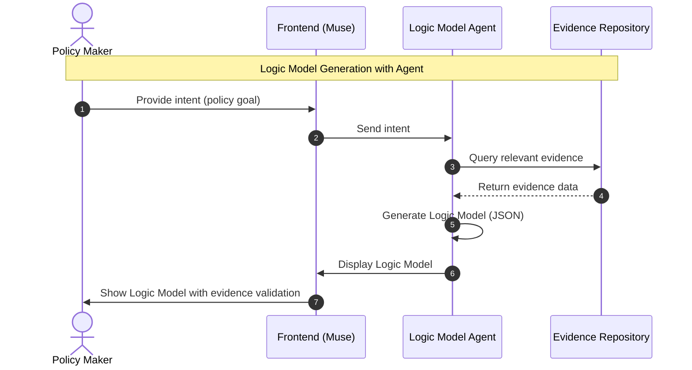

# Muse の流れ

## Sample logic model

https://ipfs.io/ipfs/bafkreidl3cz73d4gfk6uqvoicmuc4kc5n7dknn7f32v6wova3jcmb3xuxa

## Sequence Diagram

```mermaid
sequenceDiagram
    autonumber
    actor User as Policy Maker
    participant FE as Frontend (Muse)
    participant Agent as Logic Model Agent
    participant Evidence as Evidence Repository

    Note over User, Evidence: Logic Model Generation with Agent

    User->>FE: Provide intent (policy goal)
    FE->>Agent: Send intent
    Agent->>Evidence: Query relevant evidence
    Evidence-->>Agent: Return evidence data
    Agent->>Agent: Generate Logic Model (JSON)
    Agent->>FE: Display Logic Model
    FE->>User: Show Logic Model with evidence validation
```
