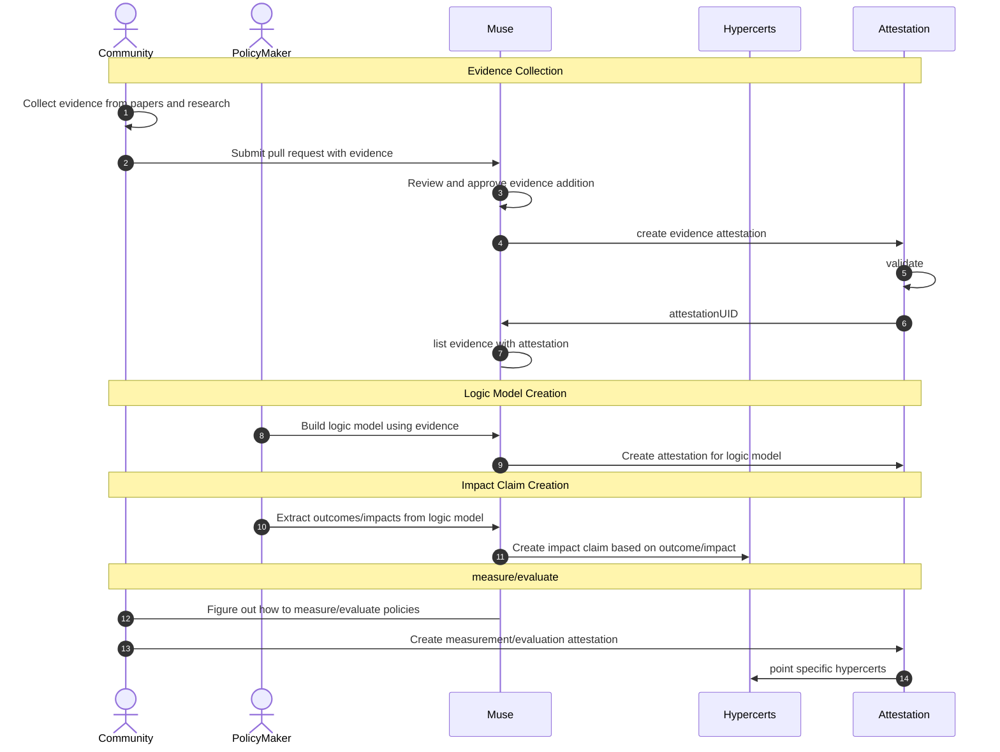

Muse の流れ

- policy maker
- hypercerts
- evidence
- community

1. コミュニティが論文などをもとにエビデンスをかき集める
2. Muse にプルリクエストを出すことで Muse にエビデンスを追加することができる。
3. policy maker は、Muse でリストされているエビデンスを参考にしながら、Muse フロントエンド上でロジックモデルを構築する
4. ロジックモデルの attestation が作成される
5. policy maker はロジックモデル上の outcome/impact を元に hypercerts で impact claim を作成する

## Sequence Diagram

・ユーザーは自分のプロジェクトのゴールを選択する
・ゴールはあらかじめプリセットされており、ドロップダウン式で選択できる
・ユーザーはエビデンスカードの中から自身のゴールに貢献しそうなものを選択できる。
・エビデンスカードとは介入（行動）、指標、短期アウトカムの３点セットで用意されているもので、そのカタログからユーザーは利用できる。
・エビデンスカードの短期アウトカムがゴールにつながるかどうかを考えるため、コンポーネントを線でつなぐような UI で提供する。
・介入がアクティビティまたはアウトプット、指標と短期アウトカムがoutcomesの中に内包されているイメージ。
・ユーザーがエビデンスカードを選択すると、canvasにおいて上記の各要素がキャンバス上に表示される
