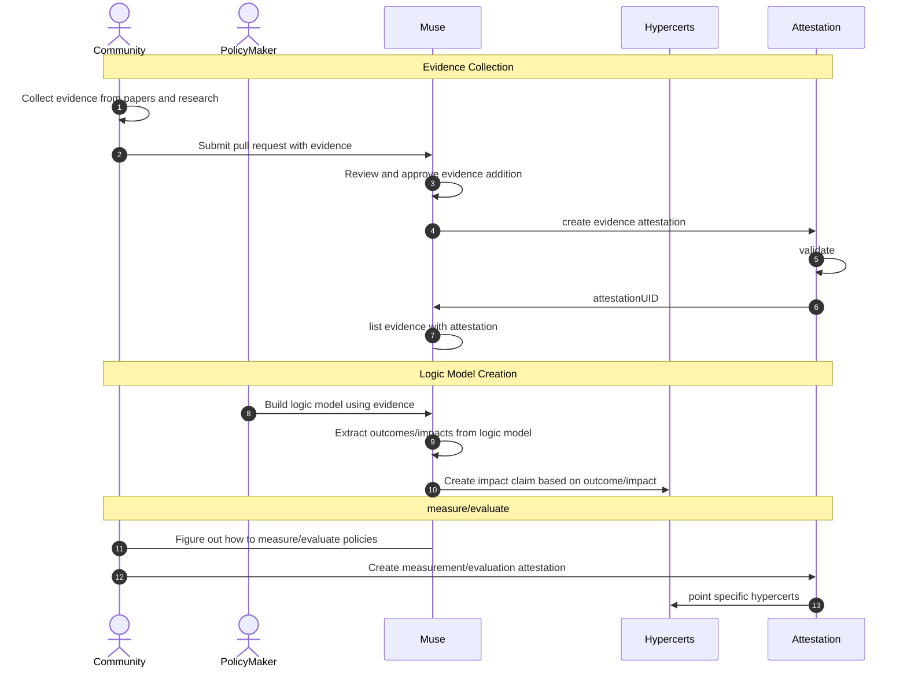

# Muse の流れ

1. コミュニティが論文などをもとにエビデンスをかき集める
2. Muse にプルリクエストを出すことで Muse にエビデンスを追加することができる。
3. policy maker は、Muse でリストされているエビデンスを参考にしながら、Muse フロントエンド上でロジックモデルを構築する
4. ロジックモデルの attestation が作成される(or store on IPFS)
5. policy maker はロジックモデル上の outcome/impact を元に hypercerts で impact claim を作成する

## Sample logic model

https://ipfs.io/ipfs/bafkreidl3cz73d4gfk6uqvoicmuc4kc5n7dknn7f32v6wova3jcmb3xuxa

## Sequence Diagram

