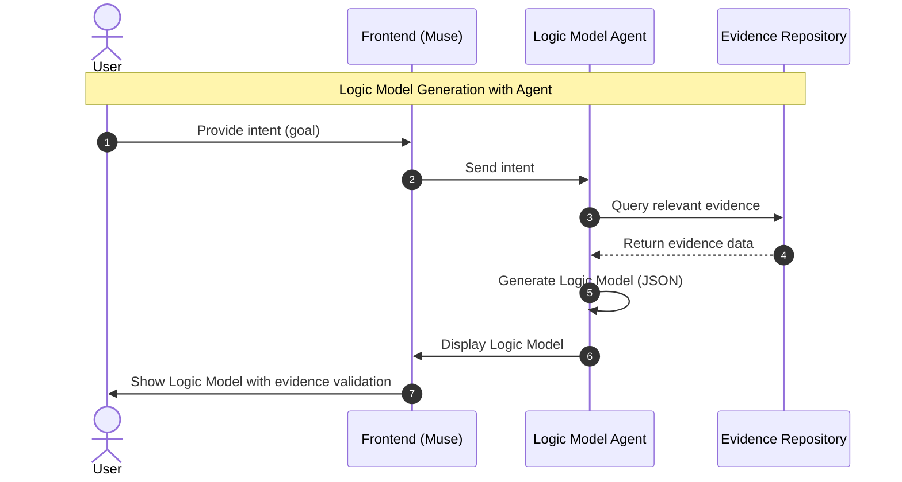
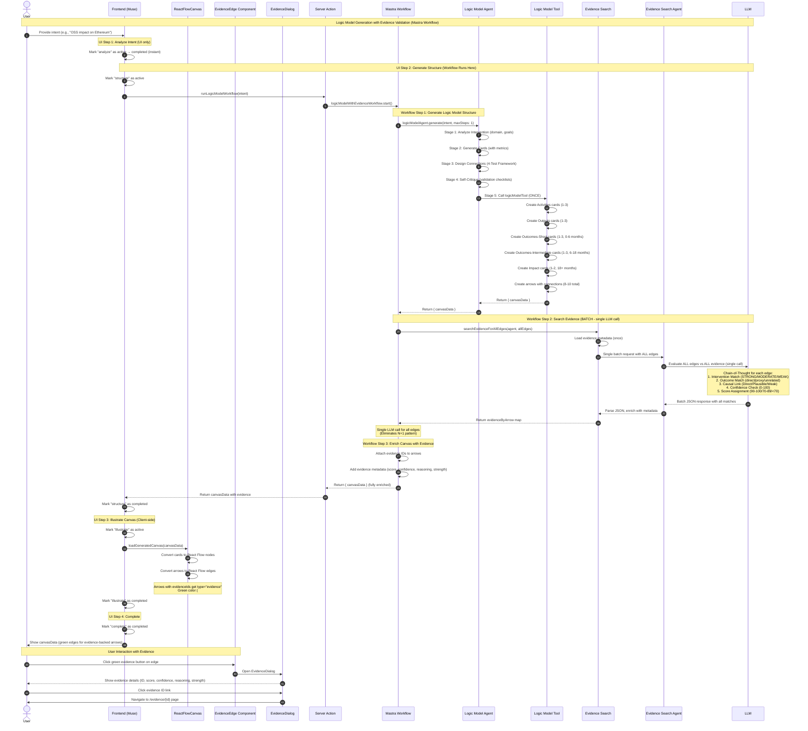

# Muse の流れ

## Sequence Diagram



## Evidence Search for Logic Model Validation

### Feature Overview

Muse automatically validates causal relationships in logic models by searching for supporting research evidence. When the Logic Model Agent generates edges (arrows) connecting cards, it searches the local evidence repository to find research that supports those relationships.

**Key Features:**

- **Automatic Validation**: Evidence search happens during logic model generation
- **LLM-Based Matching**: Uses chain-of-thought reasoning to semantically match evidence intervention→outcome relationships with logic model edges
- **Quality Indicators**: Shows evidence strength ratings (Maryland Scientific Method Scale 0-5) with warnings for low-quality evidence
- **Evidence Metadata**: Each edge stores matched evidence IDs, scores, confidence ratings, and structured reasoning

### How It Works

1. **Logic Model Generation**: Agent creates cards (Activities → Outputs → Outcomes-Short → Outcomes-Intermediate → Impact) and arrows connecting them using a 5-stage structured workflow with validation checkpoints
2. **Evidence Search**: For all arrows, evidence search executes as a **single batch request** to the Evidence Search Agent (one LLM call evaluates all edges together)
3. **Semantic Matching**: The Evidence Search Agent (using google/gemini-2.5-pro) uses chain-of-thought reasoning to evaluate if evidence intervention→outcome pairs support the edge relationship
4. **Evidence Attachment**: Top matching evidence IDs (score ≥ 70) are attached to arrows with metadata (score, confidence, reasoning, strength, intervention/outcome text)
5. **UI Display**: Frontend renders arrows with evidence as green thick edges with interactive buttons; clicking opens a dialog with full evidence details including clickable links to evidence pages

**UI Flow**: Users see 4 steps (analyze → structure → illustrate → complete), but the complete 3-step workflow (generate structure → search evidence → enrich) executes invisibly during the "structure" step

### Detailed Sequence Diagram



### Evidence Matching Example

**Logic Model Edge:**

- Card A (Activity): "Deploy GitHub Sponsors program for OSS contributors"
- Card B (Output): "Increased pull request submissions from sponsored developers"

**Evidence Match:**

```yaml
evidence_id: "05"
title: "The Effect of Rewards on Developer Contributions"
results:
  - intervention: "Listing individual OSS contributors on GitHub Sponsors"
    outcome_variable: "Submitting Pull Requests (PRs)"
    outcome: "+"
strength: 4 (Maryland Scale)
```

**LLM Evaluation (Chain-of-Thought Reasoning):**

1. **Intervention Match**: STRONG - Same concept (GitHub Sponsors program)
2. **Outcome Match**: STRONG - Direct measure (PR submissions)
3. **Causal Link**: Direct - Sponsorship incentives directly cause increased PR activity
4. **Confidence**: 95/100 - High certainty, well-established relationship
5. **Final Score**: 92/100 (STRONG match)
6. **Reasoning**: "Intervention Match: STRONG - Same concept (GitHub Sponsors). Outcome Match: STRONG - Direct measure (PR submissions). Causal Link: Direct - sponsorship directly incentivizes contributions."

### Evidence Search Philosophy

**Comprehensive Search with Realistic Expectations**

The evidence search tool searches for supporting evidence for **ALL arrows in the logic model**, accepting that most relationships won't have matching evidence from the limited repository (~21 evidence files). This is natural, expected, and scientifically valuable.

**Why Search Everything:**

1. **Complete Transparency**: Users see the full evidential landscape - which relationships are evidence-backed vs. theoretical assumptions
2. **Identify Research Gaps**: Edges without evidence highlight opportunities for future research and evidence collection
3. **Build Trust**: Honest about the evidence basis strengthens credibility more than selective presentation
4. **No Missed Opportunities**: Ensures we don't skip edges that unexpectedly have supporting evidence

**Expected Outcomes:**

- **Typical Coverage**: 2-4 edges out of 10-15 total edges may have supporting evidence
- **Evidence Gaps Are Normal**: Most logic model relationships are theoretical or based on domain knowledge, not direct research evidence
- **High-Value Matches**: When evidence IS found, it significantly strengthens those specific causal claims

**UI Presentation:**

- Green thick edges for arrows with evidence (match score ≥ 70)
- Interactive green button at edge midpoint to access evidence details
- Evidence coverage naturally visible through color coding (green vs gray edges)
- Edges without evidence appear as normal gray curves (no negative indicator)
- Dialog interface with clickable evidence IDs linking to `/evidence/{id}` pages
- Focus user attention on evidence-backed relationships through color and interactivity

**Scientific Benefit:**

This approach makes Muse's logic models more rigorous and honest. It clearly distinguishes between:

- **Evidence-backed claims** (strong confidence) ✅
- **Theoretical assumptions** (requires validation) 🔬
- **Research opportunities** (evidence gaps to fill) 📊

### Technical Implementation

**Agent Architecture & Quality Controls:**

The system uses two specialized AI agents with comprehensive quality controls:

**1. Logic Model Agent** (`mastra/agents/logic-model-agent.ts`)

Theory of Change specialist with structured 5-stage workflow:

- **Stage 1: Analyze Intervention**
  - Domain analysis (tech, education, health, civic)
  - Target population identification
  - Goal assessment and reference interventions

- **Stage 2: Generate Cards**
  - Creates 1-2 cards per stage with title (max 100 chars), description (max 200 chars), and metrics
  - Stages: Activities → Outputs → Outcomes-Short (0-6 months) → Outcomes-Intermediate (6-18 months) → Impact (18+ months)
  - Each card requires 1 metric object with name, measurementMethod, and frequency fields

- **Stage 3: Design Connections** with 4-Test Framework
  - **Directness Test**: Clear, immediate causal path (1-2 steps)
  - **Expert Test**: Would domain experts agree this is plausible?
  - **Timeframe Test**: Outcome achievable within stage timeframe?
  - **Mechanism Test**: Can you articulate how X causes Y?
  - Connection boundaries: 8-10 ideal, 25 absolute maximum
  - Per-card limits: 1-2 outgoing connections (3 max)

- **Stage 4: Self-Critique**
  - **Format Validation Checklist**: targetContext as string, metrics as objects, character limits
  - **Logic Validation Checklist**: No stage-leaping, realistic timeframes, no circular dependencies
  - **Metacognitive Questions**: "Would an expert find this questionable?", "Am I being overly optimistic?", "Did I inflate connection count?"

- **Stage 5: Call Tool**
  - Generates canvas with validated structure
  - Tool must be called exactly once (maxSteps: 1)

**Common Mistakes Prevention:**

- ❌ TOP MISTAKE #1: targetContext as object instead of string
- ❌ TOP MISTAKE #2: Metrics as strings instead of objects
- ❌ TOP MISTAKE #3: Too many (>15) or too few (<8) connections
- ❌ TOP MISTAKE #4: Weak/indirect connections to hit count
- ❌ TOP MISTAKE #5: Invalid frequency values

**2. Evidence Search Agent** (`mastra/agents/evidence-search-agent.ts`)

LLM-based evidence matching with chain-of-thought reasoning:

- **Batch Mode**: Evaluates ALL edges in single LLM call
- **Structured Reasoning** (5 sub-stages):
  1. **Intervention Match Analysis**: Rate alignment (STRONG/MODERATE/WEAK/NONE)
  2. **Outcome Match Analysis**: Direct measure, proxy measure, or unrelated
  3. **Causal Link Assessment**: Direct, Plausible, Weak, or No connection
  4. **Confidence Check**: 0-100 certainty with alternative interpretations
  5. **Final Score Assignment**: 90-100 (STRONG), 70-89 (MODERATE), <70 (excluded)

**Scoring Calibration Examples:**

- **Score 95 (STRONG)**: Same concepts, direct causal link, high confidence
- **Score 75 (MODERATE)**: Related concepts, plausible causal link, moderate confidence
- **Score 60 (WEAK - excluded)**: Indirect or weak connection, low confidence

**Borderline Handling (65-75):**

- Re-evaluate using more conservative criteria
- Ask: Would a domain expert agree?
- Check confidence: If <60, consider excluding
- When in doubt, err on side of excluding
- Document uncertainty in reasoning

**Output Format:**

```json
{
  "results": {
    "arrowId1": [
      {
        "evidenceId": "00",
        "score": 95,
        "confidence": 90,
        "reasoning": "Intervention Match: STRONG - ...",
        "interventionText": "...",
        "outcomeText": "..."
      }
    ]
  }
}
```

**Verification Checklist:**

- ✓ All arrowIds present (even if empty arrays)
- ✓ Only matches with score ≥ 70 included
- ✓ All 6 required fields present: evidenceId, score, confidence, reasoning, interventionText, outcomeText
- ✓ Reasoning follows structured format
- ✓ Confidence values populated (0-100)
- ✓ JSON format matches schema exactly

**Core Components:**

- `components/canvas/GenerateLogicModelDialog.tsx`: Main UI component with 4-step process
  - Step 1: "analyze" - Instant UI-only step
  - Step 2: "structure" - Calls server action, all workflow steps execute here
  - Step 3: "illustrate" - Client-side rendering with `loadGeneratedCanvas()`
  - Step 4: "complete" - Final state
  - Form validation with Zod, default intent example provided

- `app/actions/canvas/runWorkflow.ts`: Server action wrapper for workflow execution
  - `runLogicModelWorkflow(intent)`: Executes Mastra workflow, returns simplified result (canvasData only)
  - Sets PROJECT_ROOT environment variable for correct path resolution
  - Validates output with CanvasDataSchema
  - Returns `{ success: true, canvasData }` on success or `{ success: false, error }` on failure

- `mastra/workflows/logic-model-with-evidence.ts`: Production workflow with 3 steps:

  **Step 1: Generate Logic Model Structure**
  - Includes retry logic for tool validation errors (automatically retries with stricter prompt if metrics format fails)
  - Validates agent called logicModelTool and returned valid canvas data
  - Extracts canvasData from tool results with detailed logging

  **Step 2: Batch Evidence Search**
  - Maps card IDs to content for quick lookup
  - Prepares all edges for batch processing (filters invalid arrows)
  - Single batch call to `searchEvidenceForAllEdges`
  - Ensures all arrows have evidence entries (empty arrays if no matches)

  **Step 3: Enrich Canvas with Evidence**
  - Maps evidence matches to arrow IDs
  - Attaches evidenceIds and evidenceMetadata to arrows
  - Returns enriched canvas data

  Returns simplified output: `{ canvasData }` (stats derived from data, no separate tracking)
  Comprehensive logging with module prefix and detailed debug info

- `lib/evidence-search-batch.ts`: Batch evidence search function
  - Single LLM call for all edges (eliminates N+1 pattern)
  - Loads evidence metadata once, enriches all matches
  - Returns `Record<arrowId, EvidenceMatch[]>` map
  - Error handling returns empty results for all edges on failure

- `mastra/tools/logic-model-tool.ts`: Tool for generating logic model structure
  - Validates input format (targetContext, metrics, connections)
  - Generates canvas layout with positioning
  - Returns CanvasData conforming to schema

- `types/index.ts`: Type definitions
  - Arrow type extended with `evidenceIds: string[]` and `evidenceMetadata: EvidenceMatch[]`
  - EvidenceMatch interface with evidenceId, score, confidence, reasoning, strength, hasWarning, title, interventionText, outcomeText
  - CanvasDataSchema reused throughout for validation

**Architecture Benefits:**

- **Separation of Concerns**: Structure generation isolated from evidence search (3 distinct workflow steps)
- **Step-by-Step UI**: Users see clear progress through 4 UI steps (analyze → structure → illustrate → complete)
- **Batch Processing**: Single LLM call evaluates all edges, eliminating N+1 pattern
- **Fast Model**: Uses `google/gemini-2.5-pro` for high-quality LLM evaluation with tool calling support
- **Structured Agent Instructions**: 5-stage workflow with validation checklists and metacognitive questions for quality assurance
- **Connection Quality Framework**: 4-Test validation (Directness, Expert, Timeframe, Mechanism) ensures only strong causal links
- **Chain-of-Thought Reasoning**: Evidence search uses structured analysis for transparent decision-making
- **Retry Logic**: Automatic retry with stricter prompt if tool validation fails on first attempt
- **Simplified API**: Returns just CanvasData, consumers calculate stats as needed (no duplicate tracking)
- **Environment-aware**: PROJECT_ROOT handling ensures correct file paths in all contexts (dev, build, Next.js)
- **Production-ready Logging**: Detailed progress logs with module prefix and comprehensive debug info
- **Schema Reuse**: 100% reuse of types from `types/index.ts` (CanvasDataSchema, EvidenceMatchSchema, etc.)
- **Transparent Evidence Search**: Evidence search happens invisibly during structure step, no separate UI loading state
- **Better Error Recovery**: Retry logic catches format errors, detailed logging aids debugging
- **Observability**: Comprehensive logging with structured reasoning makes agent decisions explainable

**Environment Configuration:**

- `PROJECT_ROOT` environment variable ensures correct file paths when Mastra bundles code
- Set automatically in `package.json` scripts:
  - `"dev:mastra": "PROJECT_ROOT=$(pwd) mastra dev --dir mastra"`
  - `"build:mastra": "PROJECT_ROOT=$(pwd) mastra build --dir mastra"`
- Fallback in server action (`app/actions/canvas/runWorkflow.ts`) ensures it works from Next.js context
- **Why needed**: When Mastra bundles and runs code, `process.cwd()` points to `.mastra/output/` instead of project root
- **Solution**: `lib/evidence.ts` uses `process.env.PROJECT_ROOT || process.cwd()` for path resolution
- Resolves `ENOENT` errors when loading evidence files from `contents/evidence/`

**UI Flow (4 Steps):**

1. **Analyze Intent** (UI only) - Marks step as active → completed immediately
2. **Generate Structure** (Server) - **Full workflow executes here**:
   - Workflow Step 1: LLM generates cards and arrows with 5-stage validation
   - Workflow Step 2: Batch evidence search - single LLM call with chain-of-thought for all edges
   - Workflow Step 3: Enrich arrows with evidence metadata
3. **Illustrate Canvas** (Client) - Renders canvasData with React Flow, applies evidence styling
4. **Complete** (UI) - Displays final logic model with green edges for evidence-backed arrows

**Frontend Components:**

- `components/canvas/EvidenceEdge.tsx`: Custom React Flow edge with button toolbar
  - Uses `getBezierPath` for smooth curved edges
  - Renders green button at edge midpoint using `EdgeLabelRenderer`
  - Manages dialog open/close state

- `components/canvas/EvidenceDialog.tsx`: Modal dialog for evidence display
  - Shows evidence IDs as links to `/evidence/{id}` pages
  - Displays relevance scores, confidence ratings, reasoning, strength ratings
  - Includes intervention/outcome text and quality warnings

- `components/canvas/ReactFlowCanvas.tsx`: Canvas with custom edge type registration
  - Maps `edgeTypes: { evidence: EvidenceEdge }`
  - Automatically applies evidence styling via `arrowsToEdges()`

- `lib/canvas/react-flow-utils.ts`: Edge type detection and styling
  - Sets `type: "evidence"` for arrows with `evidenceIds`
  - Applies green thick styling (`#10b981`, 3px strokeWidth)

**Evidence Quality Scale (Maryland Scientific Method Scale):**

- 5: Randomized Controlled Trial (RCT)
- 4: Quasi-experimental with strong design
- 3: Quasi-experimental with weak design
- 2: Correlational studies
- 1: Pre-experimental
- 0: Unclear/not reported

**UI Implementation:**

- **Green Thick Edges**: Arrows with evidence display as emerald green (#10b981), 3px thick bezier curves
- **Evidence Button**: Green circular button with FileText icon at edge midpoint (only on edges with evidence)
- **Evidence Dialog**: Modal showing detailed evidence metadata when button is clicked
  - Evidence ID (clickable link to `/evidence/{id}`)
  - Relevance score (0-100) with color-coded badge
  - Confidence rating (0-100)
  - Title, reasoning, strength rating (0-5)
  - Intervention and outcome text
  - ⚠️ Warning indicator for evidence strength < 3
- **Clean Design**: No badges on cards, evidence information only visible on edges
