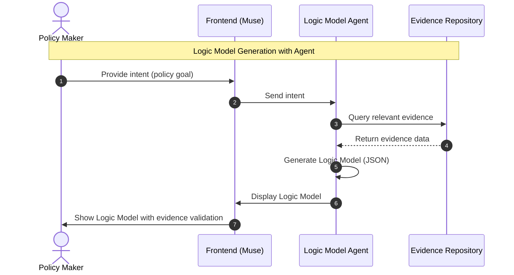
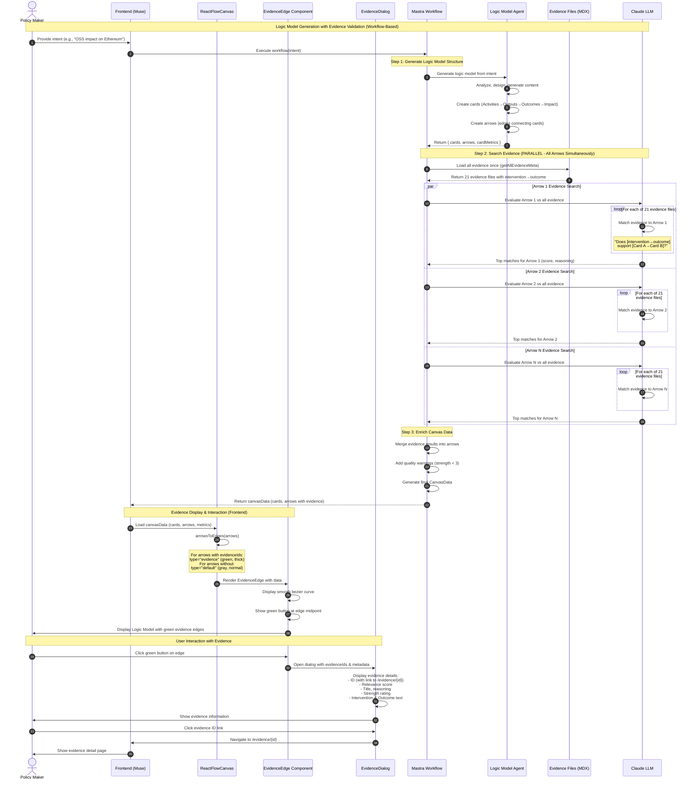

# Muse の流れ

## Sequence Diagram



## Evidence Search for Logic Model Validation

### Feature Overview

Muse automatically validates causal relationships in logic models by searching for supporting research evidence. When the Logic Model Agent generates edges (arrows) connecting cards, it searches the local evidence repository to find research that supports those relationships.

**Key Features:**

- **Automatic Validation**: Evidence search happens during logic model generation
- **LLM-Based Matching**: Uses Claude to semantically match evidence intervention→outcome relationships with logic model edges
- **Quality Indicators**: Shows evidence strength ratings (Maryland Scientific Method Scale 0-5) with warnings for low-quality evidence
- **Evidence Metadata**: Each edge stores matched evidence IDs, scores, and reasoning

### How It Works

1. **Logic Model Generation**: Agent creates cards (Activities→Outputs→Outcomes→Impact) and arrows connecting them
2. **Evidence Search**: For each arrow (Card A → Card B), the agent calls the Evidence Search Tool in parallel
3. **Semantic Matching**: The tool uses an LLM to evaluate if evidence intervention→outcome pairs support the edge relationship
4. **Evidence Attachment**: Top matching evidence IDs are attached to arrows with metadata (score, reasoning, strength)
5. **UI Display**: Frontend renders arrows with evidence as green thick edges with interactive buttons; clicking opens a dialog with full evidence details including clickable links to evidence pages

### Detailed Sequence Diagram with Workflow Architecture



**Performance Benefits:**

- **Without Workflow (Sequential)**: 10 arrows × 21 evidence × 2s = 420 seconds (~7 minutes)
- **With Workflow (Parallel)**: 21 evidence × 2s = 42 seconds per arrow, but ALL run simultaneously = **~42 seconds total**
- **Speedup**: **10x faster** for typical logic models

### Evidence Matching Example

**Logic Model Edge:**

- Card A (Activity): "Deploy GitHub Sponsors program for OSS contributors"
- Card B (Output): "Increased pull request submissions from sponsored developers"

**Evidence Match:**

```yaml
evidence_id: "05"
title: "The Effect of Rewards on Developer Contributions"
results:
  - intervention: "Listing individual OSS contributors on GitHub Sponsors"
    outcome_variable: "Submitting Pull Requests (PRs)"
    outcome: "+"
strength: 4 (Maryland Scale)
```

**LLM Evaluation:**

- Match: ✅ Yes
- Score: 92/100
- Reasoning: "Evidence directly supports the relationship. The intervention (GitHub Sponsors) matches the activity, and the outcome (PR submissions) aligns with the output metric."

### Evidence Search Philosophy

**Comprehensive Search with Realistic Expectations**

The evidence search tool searches for supporting evidence for **ALL arrows in the logic model**, accepting that most relationships won't have matching evidence from the limited repository (~21 evidence files). This is natural, expected, and scientifically valuable.

**Why Search Everything:**

1. **Complete Transparency**: Users see the full evidential landscape - which relationships are evidence-backed vs. theoretical assumptions
2. **Identify Research Gaps**: Edges without evidence highlight opportunities for future research and evidence collection
3. **Build Trust**: Honest about the evidence basis strengthens credibility more than selective presentation
4. **No Missed Opportunities**: Ensures we don't skip edges that unexpectedly have supporting evidence

**Expected Outcomes:**

- **Typical Coverage**: 2-4 edges out of 10-15 total edges may have supporting evidence
- **Evidence Gaps Are Normal**: Most logic model relationships are theoretical or based on domain knowledge, not direct research evidence
- **High-Value Matches**: When evidence IS found, it significantly strengthens those specific causal claims

**UI Presentation:**

- Green thick edges for arrows with evidence (match score > 70)
- Interactive green button at edge midpoint to access evidence details
- Evidence coverage naturally visible through color coding (green vs gray edges)
- Edges without evidence appear as normal gray curves (no negative indicator)
- Dialog interface with clickable evidence IDs linking to `/evidence/{id}` pages
- Focus user attention on evidence-backed relationships through color and interactivity

**Scientific Benefit:**
This approach makes Muse's logic models more rigorous and honest. It clearly distinguishes between:

- **Evidence-backed claims** (strong confidence) ✅
- **Theoretical assumptions** (requires validation) 🔬
- **Research opportunities** (evidence gaps to fill) 📊

### Technical Implementation

**Core Components:**

- `lib/evidence-search.ts`: LLM-based matching logic with hybrid RAG approach
- `mastra/tools/evidence-search-tool.ts`: Mastra tool for agent use
- `mastra/agents/logic-model-agent.ts`: Workflow integration
- `types/index.ts`: Arrow type extended with `evidenceIds` and `evidenceMetadata`

**Frontend Components:**

- `components/canvas/EvidenceEdge.tsx`: Custom React Flow edge with button toolbar
  - Uses `getBezierPath` for smooth curved edges
  - Renders green button at edge midpoint using `EdgeLabelRenderer`
  - Manages dialog open/close state
- `components/canvas/EvidenceDialog.tsx`: Modal dialog for evidence display
  - Shows evidence IDs as links to `/evidence/{id}` pages
  - Displays relevance scores, reasoning, strength ratings
  - Includes intervention/outcome text and quality warnings
- `components/canvas/ReactFlowCanvas.tsx`: Canvas with custom edge type registration
  - Maps `edgeTypes: { evidence: EvidenceEdge }`
  - Automatically applies evidence styling via `arrowsToEdges()`
- `lib/canvas/react-flow-utils.ts`: Edge type detection and styling
  - Sets `type: "evidence"` for arrows with `evidenceIds`
  - Applies green thick styling (`#10b981`, 3px strokeWidth)

**Evidence Quality Scale (Maryland Scientific Method Scale):**

- 5: Randomized Controlled Trial (RCT)
- 4: Quasi-experimental with strong design
- 3: Quasi-experimental with weak design
- 2: Correlational studies
- 1: Pre-experimental
- 0: Unclear/not reported

**UI Implementation:**

- **Green Thick Edges**: Arrows with evidence display as emerald green (#10b981), 3px thick bezier curves
- **Evidence Button**: Green circular button with FileText icon at edge midpoint (only on edges with evidence)
- **Evidence Dialog**: Modal showing detailed evidence metadata when button is clicked
  - Evidence ID (clickable link to `/evidence/{id}`)
  - Relevance score (0-100) with color-coded badge
  - Title, reasoning, strength rating (0-5)
  - Intervention and outcome text
  - ⚠️ Warning indicator for evidence strength < 3
- **Clean Design**: No badges on cards, evidence information only visible on edges
