# Muse の流れ

## Sequence Diagram


## Evidence Search for Logic Model Validation

### Feature Overview

Muse automatically validates causal relationships in logic models by searching for supporting research evidence. When the Logic Model Agent generates edges (arrows) connecting cards, it searches the local evidence repository to find research that supports those relationships.

**Key Features:**

- **Automatic Validation**: Evidence search happens during logic model generation
- **LLM-Based Matching**: Uses LLM to semantically match evidence intervention→outcome relationships with logic model edges
- **Quality Indicators**: Shows evidence strength ratings (Maryland Scientific Method Scale 0-5) with warnings for low-quality evidence
- **Evidence Metadata**: Each edge stores matched evidence IDs, scores, and reasoning

### How It Works

1. **Logic Model Generation**: Agent creates cards (Activities → Outputs → Outcomes-Short → Outcomes-Intermediate → Impact) and arrows connecting them
2. **Evidence Search**: For each arrow (Card A → Card B), evidence search runs **in parallel** for all arrows simultaneously using `Promise.all()` for maximum performance
3. **Semantic Matching**: The tool uses an LLM to evaluate if evidence intervention→outcome pairs support the edge relationship
4. **Evidence Attachment**: Top matching evidence IDs are attached to arrows with metadata (score, reasoning, strength)
5. **UI Display**: Frontend renders arrows with evidence as green thick edges with interactive buttons; clicking opens a dialog with full evidence details including clickable links to evidence pages

**Performance**: Parallel processing provides **20-30x speedup** compared to sequential approach (5 minutes → 10-15 seconds)

### Detailed Sequence Diagram

```mermaid
sequenceDiagram
    autonumber
    actor User as User
    participant FE as Frontend (Muse)
    participant Canvas as ReactFlowCanvas
    participant Edge as EvidenceEdge Component
    participant Dialog as EvidenceDialog
    participant Action as Server Action
    participant Workflow as Mastra Workflow
    participant Agent as Logic Model Agent
    participant Tool as Logic Model Tool
    participant Search as Evidence Search
    participant LLM

    Note over User, LLM: Logic Model Generation with Evidence Validation (Mastra Workflow)

    User->>FE: Provide intent (e.g., "OSS impact on Ethereum")

    Note over FE: Step 1: Analyze Intent (UI only)
    FE->>FE: Mark analyze as active → completed

    Note over FE, LLM: Step 2-4: Mastra Workflow (All-in-One)
    FE->>Action: runLogicModelWorkflow(intent)
    Action->>Workflow: logicModelWithEvidenceWorkflow.start()

    Note over Workflow, Agent: Workflow Step 1: Generate Logic Model Structure
    Workflow->>Agent: agent.generate(intent, maxSteps: 1)
    Agent->>Agent: Analyze user intent
    Agent->>Agent: Design logic model structure
    Agent->>Tool: Call logicModelTool (ONCE)
    Tool->>Tool: Create Activities cards (1-3)
    Tool->>Tool: Create Outputs cards (1-3)
    Tool->>Tool: Create Outcomes-Short cards (1-3, 0-6 months)
    Tool->>Tool: Create Outcomes-Intermediate cards (1-3, 6-18 months)
    Tool->>Tool: Create Impact cards (1-2, 18+ months)
    Tool->>Tool: Create arrows with connections
    Tool-->>Agent: Return { canvasData }
    Agent-->>Workflow: Return { canvasData }

    Note over Workflow, LLM: Workflow Step 2: Search Evidence (PARALLEL - all arrows at once)
    par For each arrow (parallel with Promise.all)
        Workflow->>Search: searchEvidenceForEdge(fromCard1, toCard1)
        Search->>LLM: Evaluate arrow vs all evidence
        LLM->>LLM: Match intervention→outcome pairs
        Note over LLM: "Does evidence support<br/>this relationship?"
        LLM-->>Search: Top matches (score, reasoning, strength)
        Search-->>Workflow: Return matches for arrow 1
    and
        Workflow->>Search: searchEvidenceForEdge(fromCard2, toCard2)
        Search->>LLM: Evaluate arrow vs all evidence
        LLM-->>Search: Top matches (score, reasoning, strength)
        Search-->>Workflow: Return matches for arrow 2
    and
        Workflow->>Search: searchEvidenceForEdge(fromCardN, toCardN)
        Search->>LLM: Evaluate arrow vs all evidence
        LLM-->>Search: Top matches (score, reasoning, strength)
        Search-->>Workflow: Return matches for arrow N
    end
    Note over Workflow: All searches complete simultaneously<br/>(20-30x faster than sequential)

    Note over Workflow: Workflow Step 3: Enrich Canvas with Evidence
    Workflow->>Workflow: Attach evidence IDs to arrows
    Workflow->>Workflow: Add evidence metadata (score, reasoning, strength)
    Workflow-->>Action: Return { canvasData } (fully enriched)
    Action-->>FE: Return canvasData with evidence

    Note over FE: Step 5: Display Canvas
    FE->>Canvas: Display logic model with evidence
    FE-->>User: Show canvasData (green edges for evidence-backed arrows)
```



### Evidence Matching Example

**Logic Model Edge:**

- Card A (Activity): "Deploy GitHub Sponsors program for OSS contributors"
- Card B (Output): "Increased pull request submissions from sponsored developers"

**Evidence Match:**

```yaml
evidence_id: "05"
title: "The Effect of Rewards on Developer Contributions"
results:
  - intervention: "Listing individual OSS contributors on GitHub Sponsors"
    outcome_variable: "Submitting Pull Requests (PRs)"
    outcome: "+"
strength: 4 (Maryland Scale)
```

**LLM Evaluation:**

- Match: ✅ Yes
- Score: 92/100
- Reasoning: "Evidence directly supports the relationship. The intervention (GitHub Sponsors) matches the activity, and the outcome (PR submissions) aligns with the output metric."

### Evidence Search Philosophy

**Comprehensive Search with Realistic Expectations**

The evidence search tool searches for supporting evidence for **ALL arrows in the logic model**, accepting that most relationships won't have matching evidence from the limited repository (~21 evidence files). This is natural, expected, and scientifically valuable.

**Why Search Everything:**

1. **Complete Transparency**: Users see the full evidential landscape - which relationships are evidence-backed vs. theoretical assumptions
2. **Identify Research Gaps**: Edges without evidence highlight opportunities for future research and evidence collection
3. **Build Trust**: Honest about the evidence basis strengthens credibility more than selective presentation
4. **No Missed Opportunities**: Ensures we don't skip edges that unexpectedly have supporting evidence

**Expected Outcomes:**

- **Typical Coverage**: 2-4 edges out of 10-15 total edges may have supporting evidence
- **Evidence Gaps Are Normal**: Most logic model relationships are theoretical or based on domain knowledge, not direct research evidence
- **High-Value Matches**: When evidence IS found, it significantly strengthens those specific causal claims

**UI Presentation:**

- Green thick edges for arrows with evidence (match score > 70)
- Interactive green button at edge midpoint to access evidence details
- Evidence coverage naturally visible through color coding (green vs gray edges)
- Edges without evidence appear as normal gray curves (no negative indicator)
- Dialog interface with clickable evidence IDs linking to `/evidence/{id}` pages
- Focus user attention on evidence-backed relationships through color and interactivity

**Scientific Benefit:**
This approach makes Muse's logic models more rigorous and honest. It clearly distinguishes between:

- **Evidence-backed claims** (strong confidence) ✅
- **Theoretical assumptions** (requires validation) 🔬
- **Research opportunities** (evidence gaps to fill) 📊

### Technical Implementation

**Core Components:**

- `lib/evidence-search-mastra.ts`: LLM-based matching logic using Mastra agent
- `mastra/tools/logic-model-tool.ts`: Tool for generating logic model structure
- `mastra/agents/logic-model-agent.ts`: Agent with maxSteps: 1 to prevent duplicate calls
- `app/actions/canvas/runWorkflow.ts`: Server action wrapper for workflow execution
  - `runLogicModelWorkflow(intent)`: Executes Mastra workflow, returns simplified result (canvasData only)
  - Sets PROJECT_ROOT environment variable for correct path resolution
  - Returns `{ success: true, canvasData }` on success or `{ success: false, error }` on failure
- `mastra/workflows/logic-model-with-evidence.ts`: **Active production workflow** with 3 steps:
  - **Step 1**: Generate logic model structure using Logic Model Agent (~30s)
  - **Step 2**: Parallel evidence search for all arrows using `Promise.all()` (~10-15s)
  - **Step 3**: Enrich canvas data with evidence metadata (instant)
  - Returns simplified output: `{ canvasData }` (stats derived from data, no separate tracking)
- `types/index.ts`: Arrow type extended with `evidenceIds` and `evidenceMetadata`, CanvasDataSchema reused throughout

**Architecture Benefits:**

- **Separation of Concerns**: Structure generation isolated from evidence search
- **Step-by-Step UI**: Users see clear progress through 5 distinct steps
- **Parallel Processing**: All evidence searches execute simultaneously via `Promise.all()`
- **No Rate Limiting Delays**: Removed sequential 1-second delays between arrows
- **Fast Model**: Uses `openai/gpt-4o-mini` for 3-5x faster LLM evaluation
- **Expected Performance**: 5 minutes → 10-15 seconds (20-30x speedup)
- **Simplified API**: Returns just CanvasData, consumers calculate stats as needed (no duplicate tracking)
- **Environment-aware**: PROJECT_ROOT handling ensures correct file paths in all contexts (dev, build, Next.js)
- **Production-ready Logging**: Detailed progress logs with `[Workflow]` prefix and emoji markers (✓, ✗, ⚠️, ❌, ✅) for observability
- **Schema Reuse**: 100% reuse of types from `types/index.ts` (CanvasDataSchema, EvidenceMatchSchema, etc.)

**Environment Configuration:**

- `PROJECT_ROOT` environment variable ensures correct file paths when Mastra bundles code
- Set automatically in `package.json` scripts:
  - `"dev:mastra": "PROJECT_ROOT=$(pwd) mastra dev --dir mastra"`
  - `"build:mastra": "PROJECT_ROOT=$(pwd) mastra build --dir mastra"`
- Fallback in server action (`app/actions/canvas/runWorkflow.ts`) ensures it works from Next.js context
- **Why needed**: When Mastra bundles and runs code, `process.cwd()` points to `.mastra/output/` instead of project root
- **Solution**: `lib/evidence.ts` uses `process.env.PROJECT_ROOT || process.cwd()` for path resolution
- Resolves `ENOENT` errors when loading evidence files from `contents/evidence/`

**UI Flow (5 Steps):**

1. **Analyze Intent** (UI only) - Marks step as active → completed immediately
2. **Generate Structure** (Server) - LLM generates cards and arrows (~30s)
3. **Search Evidence** (Server) - Parallel search across all arrows (~10-15s), shows coverage stats
4. **Illustrate Canvas** (Client) - Enriches arrows with evidence metadata
5. **Complete** (UI) - Displays final logic model with green edges for evidence-backed arrows

**Frontend Components:**

- `components/canvas/EvidenceEdge.tsx`: Custom React Flow edge with button toolbar
  - Uses `getBezierPath` for smooth curved edges
  - Renders green button at edge midpoint using `EdgeLabelRenderer`
  - Manages dialog open/close state
- `components/canvas/EvidenceDialog.tsx`: Modal dialog for evidence display
  - Shows evidence IDs as links to `/evidence/{id}` pages
  - Displays relevance scores, reasoning, strength ratings
  - Includes intervention/outcome text and quality warnings
- `components/canvas/ReactFlowCanvas.tsx`: Canvas with custom edge type registration
  - Maps `edgeTypes: { evidence: EvidenceEdge }`
  - Automatically applies evidence styling via `arrowsToEdges()`
- `lib/canvas/react-flow-utils.ts`: Edge type detection and styling
  - Sets `type: "evidence"` for arrows with `evidenceIds`
  - Applies green thick styling (`#10b981`, 3px strokeWidth)

**Evidence Quality Scale (Maryland Scientific Method Scale):**

- 5: Randomized Controlled Trial (RCT)
- 4: Quasi-experimental with strong design
- 3: Quasi-experimental with weak design
- 2: Correlational studies
- 1: Pre-experimental
- 0: Unclear/not reported

**UI Implementation:**

- **Green Thick Edges**: Arrows with evidence display as emerald green (#10b981), 3px thick bezier curves
- **Evidence Button**: Green circular button with FileText icon at edge midpoint (only on edges with evidence)
- **Evidence Dialog**: Modal showing detailed evidence metadata when button is clicked
  - Evidence ID (clickable link to `/evidence/{id}`)
  - Relevance score (0-100) with color-coded badge
  - Title, reasoning, strength rating (0-5)
  - Intervention and outcome text
  - ⚠️ Warning indicator for evidence strength < 3
- **Clean Design**: No badges on cards, evidence information only visible on edges
