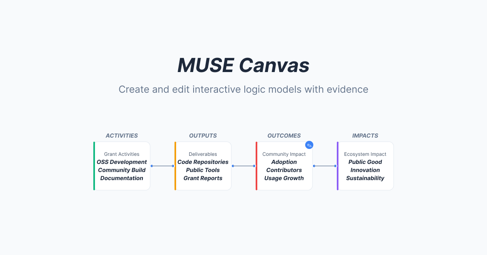

# MUSE

**Modular Stack of Evidence** — An evidence-based impact planning tool for Digital Public Goods.

[](./LICENSE)
[](https://nextjs.org/)
[](https://bun.sh/)



## Overview

MUSE helps organizations plan and measure social impact using the [Theory of Change](https://en.wikipedia.org/wiki/Theory_of_change) methodology. It combines AI-powered logic model generation with research evidence validation and blockchain-based attestations to create transparent, evidence-backed impact pathways.

Built as part of the [Beacon Labs](https://beaconlabs.io) ecosystem for supporting evidence-based practice (EBP) in Digital Public Goods (DPG).

## Features

### AI-Powered Logic Models

Mastra-based AI agents generate complete Theory of Change logic models through a 5-stage process: analyze context, generate structure, design visual layout, self-critique, and produce canvas-ready output. The result is a fully connected pathway from Activities → Outputs → Short-term Outcomes → Intermediate Outcomes → Impact.

### Evidence-Based Validation

An LLM-powered evidence search agent semantically matches research evidence against every causal relationship in a logic model. Using batch processing and chain-of-thought reasoning, it identifies which connections are backed by published research — making the distinction between evidence-supported and theoretical pathways clear. When internal evidence is limited, the system can optionally search [Semantic Scholar](https://www.semanticscholar.org/) for relevant academic papers, displayed as supplementary reference material.

### Blockchain Attestation

Evidence submissions are attested on-chain via [EAS](https://attest.org/) (Ethereum Attestation Service) on Base Sepolia, with content stored on IPFS. Logic models can generate [Hypercerts](https://hypercerts.org/) for transparent impact tracking and measurement.

### Interactive Canvas

A React Flow-powered visual builder for creating and editing logic models. Evidence-backed edges are highlighted in green, and each edge includes an interactive button to view the supporting research details, scores, and methodology.

## Architecture

```
┌─────────────────────────────────────────────────────────────────┐
│                         MUSE Platform                           │
├─────────────────────────────────────────────────────────────────┤
│                                                                 │
│  Evidence Repository          MUSE Application                  │
│  ┌──────────────┐            ┌──────────────────────────────┐  │
│  │ MDX Research  │  npm pkg  │                              │  │
│  │ Files         ├──────────►│  AI Agents (Mastra)          │  │
│  │              │            │    ├─ Logic Model Agent      │  │
│  │ Zod          │            │    └─ Evidence Search Agent  │  │
│  │ Validation   │            │           │                  │  │
│  └──────┬───────┘            │           ▼                  │  │
│         │                    │  React Flow Canvas           │  │
│         │ GitHub Actions     │    ├─ Visual Logic Models    │  │
│         ▼                    │    └─ Evidence-backed Edges  │  │
│  ┌──────────────┐            │           │                  │  │
│  │ IPFS + EAS   │            │           ▼                  │  │
│  │ Attestation  │            │  Hypercerts (Impact)         │  │
│  └──────────────┘            └──────────────────────────────┘  │
│                                                                 │
└─────────────────────────────────────────────────────────────────┘
```

## Getting Started

### Prerequisites

- [Node.js](https://nodejs.org/) 20+
- [Bun](https://bun.sh/) 1.3+

### Installation

```bash
git clone https://github.com/beaconlabs-io/muse.git
cd muse
bun install
```

### Environment Setup

Copy the example environment file and fill in the required values:

```bash
cp .env.example .env.local
```

Key variables include API keys for AI providers, `PINATA_JWT` for IPFS uploads, and `NEXT_PUBLIC_WALLETCONNECT_PROJECT_ID` for wallet connection. See `.env.example` for the full list.

### Development

```bash
bun dev
```

Open [http://localhost:3000](http://localhost:3000) to see the application.

## Scripts

| Command            | Description                           |
| ------------------ | ------------------------------------- |
| `bun dev`          | Start Next.js development server      |
| `bun run build`    | Build for production                  |
| `bun start`        | Start production server               |
| `bun lint`         | Run ESLint with auto-fix              |
| `bun format`       | Format code with Prettier             |
| `bun clean`        | Clean build artifacts and reinstall   |
| `bun dev:mastra`   | Start Mastra agent development server |
| `bun build:mastra` | Build Mastra agent system             |

## Project Structure

```
.
├── app/                  # Next.js App Router
│   ├── canvas/           #   Interactive logic model builder
│   ├── evidence/         #   Evidence browsing and detail pages
│   ├── hypercerts/       #   Hypercerts integration
│   └── api/              #   Server-side API endpoints
├── components/           # React components
│   ├── canvas/           #   React Flow nodes, edges, and controls
│   ├── evidence/         #   Evidence-specific UI components
│   └── ui/               #   shadcn/ui primitives (auto-generated)
├── mastra/               # AI agent system
│   ├── agents/           #   Logic model and evidence search agents
│   ├── workflows/        #   Multi-step agent workflows
│   ├── tools/            #   Agent tools (canvas data, evidence access)
│   └── skills/           #   Domain knowledge for agents
├── lib/                  # Shared utilities and configuration
├── hooks/                # Custom React hooks
├── types/                # TypeScript type definitions
└── docs/                 # Technical documentation
```

## Documentation

For detailed technical information, see:

| Document                                                     | Description                                    |
| ------------------------------------------------------------ | ---------------------------------------------- |
| [AI Agent Architecture](./docs/mastra-agents.md)             | Agent workflows, quality controls, Skills API  |
| [Evidence Workflow](./docs/evidence-workflow.md)             | Submission, attestation, search philosophy     |
| [React Flow Architecture](./docs/react-flow-architecture.md) | Canvas implementation, evidence edges, UI flow |

## Deployments

|             | Environment   | URL                                                              |
| ----------- | ------------- | ---------------------------------------------------------------- |
| Production  | `production`  | [https://muse.beaconlabs.io](https://muse.beaconlabs.io)         |
| Development | `development` | [https://dev.muse.beaconlabs.io](https://dev.muse.beaconlabs.io) |

## Contributing

Contributions are welcome! Please see [CONTRIBUTING.md](./CONTRIBUTING.md) for development workflow, code style guidelines, and the pull request process.

Evidence files are managed in a separate repository: [beaconlabs-io/evidence](https://github.com/beaconlabs-io/evidence).

## License

This project is licensed under the [Apache License 2.0](./LICENSE).
