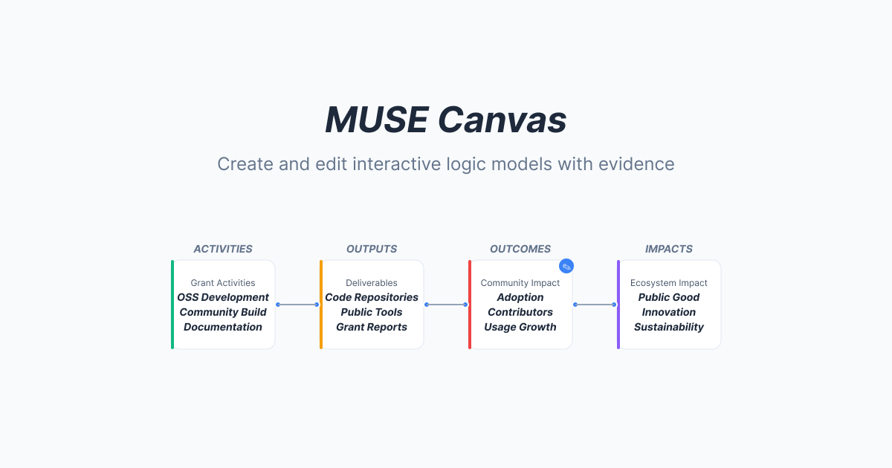

# MUSE

**Modular Stack of Evidence** — An evidence-based impact planning tool for Digital Public Goods.

[](./LICENSE)
[](https://nextjs.org/)
[](https://bun.sh/)



## Overview

MUSE helps organizations plan and measure social impact using the [Theory of Change](https://en.wikipedia.org/wiki/Theory_of_change) methodology. It combines AI-powered logic model generation with research evidence validation and blockchain-based attestations to create transparent, evidence-backed impact pathways.

Built as part of the [Beacon Labs](https://beaconlabs.io) ecosystem for supporting evidence-based practice (EBP) in Digital Public Goods (DPG).

## Features

### AI-Powered Logic Models

AI agents in the `muse-backend` service generate complete Theory of Change logic models through a 5-stage process: analyze context, generate structure, design visual layout, self-critique, and produce canvas-ready output. The result is a fully connected pathway from Activities → Outputs → Short-term Outcomes → Intermediate Outcomes → Impact.

### Evidence-Based Validation

An LLM-powered evidence search agent semantically matches research evidence against every causal relationship in a logic model. Using batch processing and chain-of-thought reasoning, it identifies which connections are backed by published research — making the distinction between evidence-supported and theoretical pathways clear. When internal evidence is limited, the system can optionally search [Semantic Scholar](https://www.semanticscholar.org/) for relevant academic papers, displayed as supplementary reference material.

### Blockchain Attestation

Evidence submissions are attested on-chain via [EAS](https://attest.org/) (Ethereum Attestation Service) on Base Sepolia, with content stored on IPFS.

### Interactive Canvas

A React Flow-powered visual builder for creating and editing logic models. Evidence-backed edges are highlighted in green, and each edge includes an interactive button to view the supporting research details, scores, and methodology.

## Architecture

```
┌─────────────────────────────────────────────────────────────────┐
│                         MUSE Platform                           │
├─────────────────────────────────────────────────────────────────┤
│                                                                 │
│  Evidence Repository          MUSE Application                  │
│  ┌──────────────┐            ┌──────────────────────────────┐  │
│  │ MDX Research  │  npm pkg  │                              │  │
│  │ Files         ├──────────►│  AI Agents (muse-backend)    │  │
│  │              │            │    ├─ Logic Model Agent      │  │
│  │ Zod          │            │    └─ Evidence Search Agent  │  │
│  │ Validation   │            │           │                  │  │
│  └──────┬───────┘            │           ▼                  │  │
│         │                    │  React Flow Canvas           │  │
│         │ GitHub Actions     │    ├─ Visual Logic Models    │  │
│         ▼                    │    └─ Evidence-backed Edges  │  │
│  ┌──────────────┐            │           │                  │  │
│  │ IPFS + EAS   │            │           ▼                  │  │
│  │ Attestation  │            │    └─ IPFS-backed Sharing    │  │
│  └──────────────┘            └──────────────────────────────┘  │
│                                                                 │
└─────────────────────────────────────────────────────────────────┘
```

The application supports English and Japanese (next-intl), with all pages routed through `app/[lang]/`. Prefix-less URLs are redirected to a locale prefix by the rules in `i18n/locale-redirects.ts` — see [docs/i18n.md](./docs/i18n.md) for the precedence order.

## Getting Started

### Prerequisites

- [Node.js](https://nodejs.org/) 20.9+
- [Bun](https://bun.sh/) 1.3+

### Installation

```bash
git clone https://github.com/beaconlabs-io/muse.git
cd muse
bun install
```

### Environment Setup

```bash
cp .env.example .env.local
```

See [docs/setup.md](./docs/setup.md) for the full variable reference grouped by concern (backend service URL, EAS chain, feature flags, runtime) and common troubleshooting.

### Development

```bash
bun dev
```

Open [http://localhost:3000](http://localhost:3000) to see the application.

### Docker

A production-style image is available via the repo-root `Dockerfile` and `docker-compose.yml`:

```bash
bun run docker:build
bun run docker:up
```

These wrappers pass `--env-file .env.local` to `docker compose`, so the `NEXT_PUBLIC_*` build args resolve from that file.

See [docs/setup.md](./docs/setup.md#docker) for build args vs runtime env, persistence notes, and gotchas.

## Scripts

| Command                 | Description                                                                          |
| ----------------------- | ------------------------------------------------------------------------------------ |
| `bun dev`               | Start Next.js development server                                                     |
| `bun run build`         | Build for production                                                                 |
| `bun start`             | Start production server                                                              |
| `bun lint`              | Run ESLint with auto-fix                                                             |
| `bun lint:check`        | Run ESLint without fixing (the command CI runs)                                      |
| `bun run test`          | Run Vitest in watch mode                                                             |
| `bun run test:run`      | Run unit tests once                                                                  |
| `bun run test:coverage` | Run unit tests with coverage                                                         |
| `bun run build:worker`  | Build the app into a Cloudflare Worker with OpenNext (output: `.open-next/`)         |
| `bun run preview`       | Build the Worker and run it locally with `opennextjs-cloudflare preview`             |
| `bun run deploy:worker` | Build and deploy the Worker to Cloudflare                                            |
| `bun run docker:build`  | Build the production image (`docker compose --env-file .env.local build`)            |
| `bun run docker:up`     | Start the container in the background (`docker compose --env-file .env.local up -d`) |
| `bun run docker:down`   | Stop and remove the container                                                        |
| `bun run docker:logs`   | Follow container logs                                                                |
| `bun clean`             | Clean build artifacts and reinstall                                                  |

The three Worker scripts prefix `NEXT_UNOPTIMIZED_IMAGES=true`, because Cloudflare Workers has no image-optimization server; the default and Docker builds leave Next.js image optimization enabled.

## Project Structure

```
.
├── app/                  # Next.js App Router
│   ├── [lang]/           #   Locale-routed pages (en, ja)
│   │   ├── canvas/       #     Interactive logic model builder
│   │   ├── evidence/     #     Evidence browsing and detail pages
│   │   ├── effects/      #     Effects/outcomes listing
│   │   ├── search/       #     Evidence search and filtering
│   │   └── strength-of-evidence/  # Scientific Maryland Scale
│   └── api/og/           #   OG image generation routes (canvas, evidence)
├── components/           # React components
│   ├── canvas/           #   React Flow nodes, edges, and controls
│   ├── evidence/         #   Evidence-specific UI components
│   ├── ui/               #   shadcn/ui primitives (auto-generated)
│   └── locale-cookie-sync.tsx  # Keeps the NEXT_LOCALE cookie in sync with the URL
├── configs/              # EAS GraphQL endpoint configuration
├── i18n/                 # next-intl config, locale redirect rules, request config
├── messages/             # Translation files (en, ja)
├── lib/                  # Shared utilities and configuration
├── hooks/                # Custom React hooks
├── types/                # TypeScript type definitions
└── docs/                 # Technical documentation
```

## Documentation

For detailed technical information, see:

| Document                                                     | Description                                             |
| ------------------------------------------------------------ | ------------------------------------------------------- |
| [Evidence Workflow](./docs/evidence-workflow.md)             | Submission, attestation, batch matching pipeline        |
| [React Flow Architecture](./docs/react-flow-architecture.md) | Canvas implementation, evidence edges, UI flow          |
| [Frontend Map](./docs/frontend-map.md)                       | Non-canvas components, server actions, custom hooks     |
| [API Routes](./docs/api-routes.md)                           | HTTP endpoints: OG images here, the rest on the backend |
| [Setup](./docs/setup.md)                                     | Local setup, environment variables, troubleshooting     |
| [Testing](./docs/testing.md)                                 | Vitest conventions, patterns, and CI integration        |
| [Internationalization](./docs/i18n.md)                       | next-intl wiring and agent output language              |

## Deployments

|             | URL                                                              |
| ----------- | ---------------------------------------------------------------- |
| Production  | [https://muse.beaconlabs.io](https://muse.beaconlabs.io)         |
| Development | [https://dev.muse.beaconlabs.io](https://dev.muse.beaconlabs.io) |

The app can be built into a Cloudflare Worker with [OpenNext](https://opennext.js.org/cloudflare); deploy it with `bun run deploy:worker`. The per-environment Worker wiring (staging/production names, routes, CI deploy) is not yet in `wrangler.jsonc`. Deploying with a plain `wrangler deploy` is unsupported: it skips the prerender-cache population step, which makes the statically generated evidence pages 404. See [docs/setup.md](./docs/setup.md#cloudflare-workers-opennext) for the Worker and Docker paths.

## Contributing

Contributions are welcome! Please see [CONTRIBUTING.md](./CONTRIBUTING.md) for development workflow, code style guidelines, and the pull request process.

Evidence files are managed in a separate repository: [beaconlabs-io/evidence](https://github.com/beaconlabs-io/evidence).

## License

This project is licensed under the [Apache License 2.0](./LICENSE).
