# Evidence Workflow

This document details the complete evidence submission, attestation, and storage workflow in MUSE.

## Evidence Structure

Evidence files use MDX format with YAML frontmatter containing:

### Required Fields

- **`evidence_id`** - Unique identifier for the evidence
- **`title`** - Descriptive title of the research or study
- **`results`** - Array of intervention/outcome data with effect categories:
  - `N/A`: Unclear or not applicable
  - `+`: Effect Present (positive impact)
  - `-`: No Effect detected
  - `+-`: Mixed results
  - `!`: Side Effects or negative impacts
- **`strength`** - Evidence strength rating using Maryland Scientific Method Scale (0-5):
  - **5**: Randomized Controlled Trial (RCT)
  - **4**: Quasi-experimental with strong controls
  - **3**: Quasi-experimental with weak controls
  - **2**: Correlational study
  - **1**: Pre-experimental design
  - **0**: Unclear or not specified
- **`methodologies`** - Research methodologies used (e.g., "RCT", "Quasi-experimental")
- **`citation`** - Academic paper references with type and source

### Optional Fields

- `attestationUID` - Blockchain attestation reference (automatically populated via GitHub Actions)
- `date` - Publication or study date
- `tags` - Categorization tags
- `author` - Study authors
- `version` - Evidence file version
- `datasets` - Associated datasets or data sources

### Example Frontmatter

```yaml
---
evidence_id: "ev_001"
title: "Impact of Educational Interventions on Student Outcomes"
results:
  - intervention: "After-school tutoring programs"
    outcome: "Improved math scores"
    effect: "+"
strength: 5
methodologies: ["RCT"]
citation:
  type: "journal"
  source: "Journal of Educational Research, 2023"
tags: ["education", "tutoring", "mathematics"]
attestationUID: "0x..."
---
```

## Evidence Submission Workflow

### Sequence Diagram

```mermaid
sequenceDiagram
    autonumber
    participant C as Contributor
    participant GH as GitHub
    participant VA as Validation<br/>Workflow
    participant R as Reviewer
    participant AT as Attestation<br/>Workflow
    participant IPFS as Pinata/IPFS
    participant EAS as EAS<br/>(Blockchain)

    rect rgb(240, 248, 255)
        Note over C,GH: 1. Submission Phase
        C->>GH: Fork repository
        C->>C: Create evidence.mdx
        C->>GH: Open PR to dev branch
    end

    rect rgb(255, 248, 240)
        Note over GH,VA: 2. Auto Validation Phase
        GH->>VA: Trigger on PR open
        VA->>VA: Parse MDX frontmatter
        VA->>VA: Validate with Zod schema
        alt Validation Failed
            VA-->>GH: ❌ Status check failed
            VA-->>C: Error details in PR
        else Validation Passed
            VA-->>GH: ✅ Status check passed
        end
    end

    rect rgb(240, 255, 240)
        Note over R,AT: 3. Review & Attestation Phase
        R->>GH: Review evidence content
        R->>GH: Comment "/attest"
        GH->>AT: Trigger attestation workflow
        AT->>AT: Verify validation passed
        AT->>AT: Check user permissions
    end

    rect rgb(255, 240, 255)
        Note over AT,EAS: 4. Blockchain Attestation Phase
        AT->>IPFS: Upload MDX content
        IPFS-->>AT: Return IPFS hash (CID)
        AT->>EAS: Create attestation
        Note right of EAS: Schema: evidence_id,<br/>ipfs_hash, strength,<br/>methodology
        EAS-->>AT: Return attestation UID
    end

    rect rgb(255, 255, 240)
        Note over AT,GH: 5. Finalization Phase
        AT->>AT: Generate deployment JSON
        AT->>GH: Commit to PR branch:<br/>- deployments/*.json<br/>- Update MDX attestationUID
        AT-->>GH: ✅ Attestation complete
        GH-->>C: PR ready to merge
        R->>GH: Merge PR to dev
    end
```



### 1. Community Contribution

Communities create MDX files in the [evidence repository](https://github.com/beaconlabs-io/evidence) following the format specified in its README:

1. Fork the [evidence repository](https://github.com/beaconlabs-io/evidence)
2. Create a new `.mdx` file in `evidence/`
3. Fill in the required frontmatter fields
4. Write the evidence content in MDX format
5. Submit a pull request to the `dev` branch

### 2. Auto Validation (on PR open)

The validation workflow (`.github/workflows/evidence-validation.yml`) automatically:

- Parses MDX frontmatter using `gray-matter`
- Validates against `EvidenceFrontmatterSchema` (Zod)
- Checks required fields: `evidence_id`, `title`, `author`, `date`, `citation`, `results`, `strength`, `methodologies`
- Validates strength levels (0-5 SMS scale)
- Validates outcome effects (`N/A`, `+`, `-`, `+-`, `!`)

### 3. Review & Approval

- Repository maintainers review the evidence for:
  - Proper formatting and required fields
  - Academic rigor and citation quality
  - Appropriate strength rating
  - Accurate effect categorization
- When approved, reviewer comments **`/attest`** to trigger attestation

### 4. Blockchain Attestation (on /attest command)

The attestation workflow (`.github/workflows/evidence-attestation.yml`) is triggered when a reviewer comments `/attest`:

**Pre-checks:**

- Verifies commenter has write/admin permissions
- Confirms validation workflow passed

**Step 1: IPFS Upload**

- Extracts MDX content from the file
- Uploads content to IPFS via Pinata API
- Receives IPFS hash (CID) for permanent storage

**Step 2: Blockchain Attestation**

- Creates an EAS (Ethereum Attestation Service) attestation on-chain
- Attestation includes:
  - Reference to IPFS hash
  - Evidence metadata (ID, strength, methodologies)
  - Timestamp and attestor address
- Returns attestation UID

**Step 3: Deployment Metadata**

- Generates JSON file in `deployments/`
- File includes:
  - Attestation UID
  - IPFS hash
  - Deployment timestamp
  - Evidence ID reference

**Step 4: Commit to PR Branch**

- Commits deployment JSON to PR branch
- Updates original MDX file with `attestationUID` field
- PR is now ready to merge with all attestation data included

### Required Secrets

The GitHub Actions workflow requires:

- `PINATA_JWT` - Pinata API authentication for IPFS uploads
- `PRIVATE_KEY` - Ethereum private key for creating attestations

## Evidence Usage in Logic Models

Evidence is semantically matched to logic model arrows (causal relationships) using:

1. **LLM-based matching** - Uses `google/gemini-2.5-pro` via `lib/evidence-search-mastra.ts`
2. **Batch processing** - Single LLM call evaluates all arrows together (not parallel N+1)
3. **Match criteria**:
   - Intervention in evidence aligns with arrow source
   - Outcome in evidence aligns with arrow target
   - Match score ≥ 70 threshold for display
4. **Result display**:
   - Green thick edges (#10b981) for evidence-backed relationships
   - Interactive button at edge midpoint
   - Evidence dialog with ID, title, score, reasoning, strength
   - Clickable links to `/evidence/{id}` detail pages

## Evidence Search Philosophy

### Comprehensive Search with Realistic Expectations

The evidence search tool searches for supporting evidence for **ALL arrows in the logic model**, accepting that most relationships won't have matching evidence from the limited repository (~21 evidence files). This is natural, expected, and scientifically valuable.

### Why Search Everything

1. **Complete Transparency**: Users see the full evidential landscape - which relationships are evidence-backed vs. theoretical assumptions
2. **Identify Research Gaps**: Edges without evidence highlight opportunities for future research and evidence collection
3. **Build Trust**: Honest about the evidence basis strengthens credibility more than selective presentation
4. **No Missed Opportunities**: Ensures we don't skip edges that unexpectedly have supporting evidence

### Expected Outcomes

- **Typical Coverage**: 2-4 edges out of 10-15 total edges may have supporting evidence
- **Evidence Gaps Are Normal**: Most logic model relationships are theoretical or based on domain knowledge, not direct research evidence
- **High-Value Matches**: When evidence IS found, it significantly strengthens those specific causal claims

### UI Presentation

- Green thick edges for arrows with evidence (match score ≥ 70)
- Interactive green button at edge midpoint to access evidence details
- Evidence coverage naturally visible through color coding (green vs gray edges)
- Edges without evidence appear as normal gray curves (no negative indicator)
- Dialog interface with clickable evidence IDs linking to `/evidence/{id}` pages
- Focus user attention on evidence-backed relationships through color and interactivity

### Scientific Benefit

This approach makes Muse's logic models more rigorous and honest. It clearly distinguishes between:

- **Evidence-backed claims** (strong confidence) ✅
- **Theoretical assumptions** (requires validation) 🔬
- **Research opportunities** (evidence gaps to fill) 📊

## File Locations

- Evidence files: `evidence-repo/evidence/*.mdx`
- Deployment metadata: `deployments/*.json`
- Format documentation: `evidence-repo/README.md`
- Validation workflow: `evidence-repo/.github/workflows/evidence-validation.yml` (in evidence repository)
- Attestation workflow: `evidence-repo/.github/workflows/evidence-attestation.yml` (in evidence repository)
- Validation script: `evidence-repo/.github/scripts/validate-evidence.ts` (in evidence repository)
- Type definitions: `types/index.ts` (Zod schemas)
- Evidence parsing: `lib/evidence.ts`
- Evidence search: `lib/evidence-search-mastra.ts`
