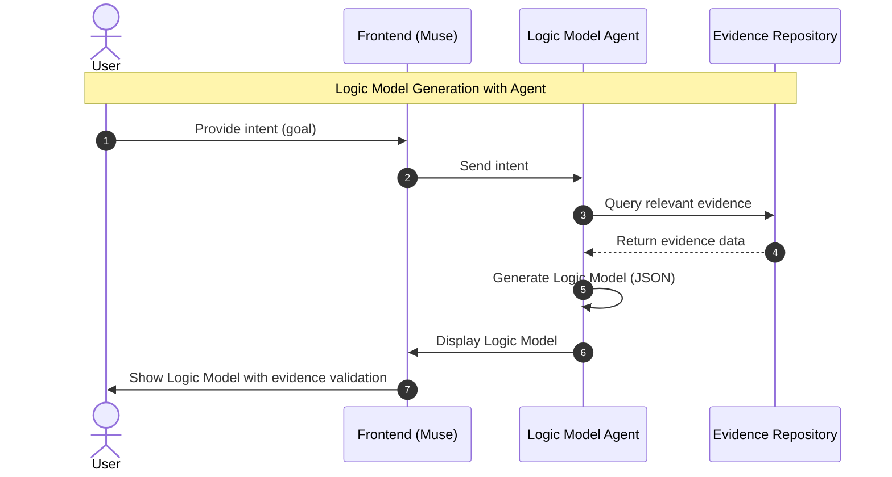
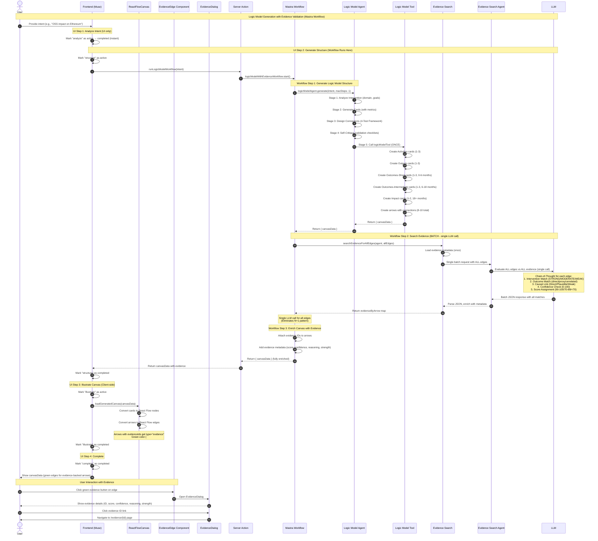

# Mastra Agent System

This document details the AI-powered agent system using the Mastra framework for logic model generation and evidence validation.

## Workflow Diagrams

### High-Level Workflow



### Detailed Workflow with Components



## Architecture Overview

The application uses Mastra to orchestrate AI-powered logic model generation with evidence validation.

### Core Components

- **`mastra/workflows/`** - Multi-step workflows that coordinate agent execution
- **`mastra/agents/`** - LLM-powered agents (e.g., Logic Model Agent)
- **`mastra/tools/`** - Custom tools agents can use (e.g., Evidence Search Tool)

## Logic Model Generation Workflow

### Step 1: Structure Generation

**Input**: User intent (e.g., "Create a logic model for improving student literacy")

**Process**:

- Agent analyzes user intent
- Generates logic model structure with:
  - **Cards**: Representing stages (activities, outputs, outcomes, impact)
  - **Arrows**: Representing causal relationships ("if X, then Y")

**Output**: `CanvasData` with cards and arrows (no evidence yet)

### Step 2: Batch Evidence Search

**Critical Feature**: Single LLM call for all arrows (not parallel execution - eliminates N+1 pattern)

**Process**:

1. Collect all arrows from generated logic model
2. Format as batch input for LLM:
   ```json
   {
     "arrows": [
       {"id": "arrow1", "source": "After-school tutoring", "target": "Improved math scores"},
       {"id": "arrow2", "source": "Teacher training", "target": "Better instruction quality"}
     ],
     "evidence_library": [...all available evidence...]
   }
   ```
3. Single LLM call evaluates all arrows at once
4. LLM returns batch results with match scores, reasoning, and evidence IDs

**LLM Model**: `google/gemini-2.5-pro` (configured in `lib/evidence-search-mastra.ts`)

**Matching Criteria**:

- Evidence intervention semantically aligns with arrow source
- Evidence outcome semantically aligns with arrow target
- Match score ≥ 70 threshold for inclusion

**Output Format**:

```typescript
{
  arrowId: string,
  matchedEvidenceId: string | null,
  score: number,        // 0-100
  confidence: string,   // "high" | "medium" | "low"
  reasoning: string,    // Chain-of-thought explanation
  strength: number      // Evidence strength (0-5)
}
```

### Step 3: Result Merging

**Process**:

- Results from batch evidence search merged into canvas data
- Arrows with matches (score ≥ 70) get `evidenceIds` populated
- Evidence metadata attached to arrows:
  ```typescript
  {
    ...arrow,
    evidenceIds: ["ev_001"],
    evidenceScore: 85,
    evidenceReasoning: "Strong alignment between tutoring intervention and math outcomes",
    evidenceStrength: 5
  }
  ```

**Output**: Complete `CanvasData` with evidence-backed arrows

## Agent Architecture & Quality Controls

The system uses two specialized AI agents with comprehensive quality controls:

### 1. Logic Model Agent

**Location**: `mastra/agents/logic-model-agent.ts`

Theory of Change specialist with structured 5-stage workflow:

#### Stage 1: Analyze Intervention

- Domain analysis (tech, education, health, civic)
- Target population identification
- Goal assessment and reference interventions

#### Stage 2: Generate Cards

- Creates 1-2 cards per stage with title (max 100 chars), description (max 200 chars), and metrics
- Stages: Activities → Outputs → Outcomes-Short (0-6 months) → Outcomes-Intermediate (6-18 months) → Impact (18+ months)
- Each card requires 1 metric object with name, measurementMethod, and frequency fields

#### Stage 3: Design Connections with 4-Test Framework

- **Directness Test**: Clear, immediate causal path (1-2 steps)
- **Expert Test**: Would domain experts agree this is plausible?
- **Timeframe Test**: Outcome achievable within stage timeframe?
- **Mechanism Test**: Can you articulate how X causes Y?
- Connection boundaries: 8-10 ideal, 25 absolute maximum
- Per-card limits: 1-2 outgoing connections (3 max)

#### Stage 4: Self-Critique

- **Format Validation Checklist**: targetContext as string, metrics as objects, character limits
- **Logic Validation Checklist**: No stage-leaping, realistic timeframes, no circular dependencies
- **Metacognitive Questions**: "Would an expert find this questionable?", "Am I being overly optimistic?", "Did I inflate connection count?"

#### Stage 5: Call Tool

- Generates canvas with validated structure
- Tool must be called exactly once (maxSteps: 1)

### Common Mistakes Prevention

- ❌ **TOP MISTAKE #1**: targetContext as object instead of string
- ❌ **TOP MISTAKE #2**: Metrics as strings instead of objects
- ❌ **TOP MISTAKE #3**: Too many (>15) or too few (<8) connections
- ❌ **TOP MISTAKE #4**: Weak/indirect connections to hit count
- ❌ **TOP MISTAKE #5**: Invalid frequency values

### 2. Evidence Search Agent

**Location**: `mastra/agents/evidence-search-agent.ts`

LLM-based evidence matching with chain-of-thought reasoning:

- **Batch Mode**: Evaluates ALL edges in single LLM call
- **Structured Reasoning** (5 sub-stages):
  1. **Intervention Match Analysis**: Rate alignment (STRONG/MODERATE/WEAK/NONE)
  2. **Outcome Match Analysis**: Direct measure, proxy measure, or unrelated
  3. **Causal Link Assessment**: Direct, Plausible, Weak, or No connection
  4. **Confidence Check**: 0-100 certainty with alternative interpretations
  5. **Final Score Assignment**: 90-100 (STRONG), 70-89 (MODERATE), <70 (excluded)

### Scoring Calibration Examples

- **Score 95 (STRONG)**: Same concepts, direct causal link, high confidence
- **Score 75 (MODERATE)**: Related concepts, plausible causal link, moderate confidence
- **Score 60 (WEAK - excluded)**: Indirect or weak connection, low confidence

### Borderline Handling (65-75)

- Re-evaluate using more conservative criteria
- Ask: Would a domain expert agree?
- Check confidence: If <60, consider excluding
- When in doubt, err on side of excluding
- Document uncertainty in reasoning

### Evidence Search Output Format

```json
{
  "results": {
    "arrowId1": [
      {
        "evidenceId": "00",
        "score": 95,
        "confidence": 90,
        "reasoning": "Intervention Match: STRONG - ...",
        "interventionText": "...",
        "outcomeText": "..."
      }
    ]
  }
}
```

### Verification Checklist

- ✓ All arrowIds present (even if empty arrays)
- ✓ Only matches with score ≥ 70 included
- ✓ All 6 required fields present: evidenceId, score, confidence, reasoning, interventionText, outcomeText
- ✓ Reasoning follows structured format
- ✓ Confidence values populated (0-100)
- ✓ JSON format matches schema exactly

## Core Components

### GenerateLogicModelDialog.tsx

**Location**: `components/canvas/GenerateLogicModelDialog.tsx`

Main UI component with 4-step process:

- Step 1: "analyze" - Instant UI-only step
- Step 2: "structure" - Calls server action, all workflow steps execute here
- Step 3: "illustrate" - Client-side rendering with `loadGeneratedCanvas()`
- Step 4: "complete" - Final state
- Form validation with Zod, default intent example provided

### runWorkflow.ts

**Location**: `app/actions/canvas/runWorkflow.ts`

Server action wrapper for workflow execution:

- `runLogicModelWorkflow(intent)`: Executes Mastra workflow, returns simplified result (canvasData only)
- Validates output with CanvasDataSchema
- Returns `{ success: true, canvasData }` on success or `{ success: false, error }` on failure

### logic-model-with-evidence.ts

**Location**: `mastra/workflows/logic-model-with-evidence.ts`

Production workflow with 3 steps:

**Step 1: Generate Logic Model Structure**

- Includes retry logic for tool validation errors (automatically retries with stricter prompt if metrics format fails)
- Validates agent called logicModelTool and returned valid canvas data
- Extracts canvasData from tool results with detailed logging

**Step 2: Batch Evidence Search**

- Maps card IDs to content for quick lookup
- Prepares all edges for batch processing (filters invalid arrows)
- Single batch call to `searchEvidenceForAllEdges`
- Ensures all arrows have evidence entries (empty arrays if no matches)

**Step 3: Enrich Canvas with Evidence**

- Maps evidence matches to arrow IDs
- Attaches evidenceIds and evidenceMetadata to arrows
- Returns enriched canvas data

Returns simplified output: `{ canvasData }` (stats derived from data, no separate tracking)
Comprehensive logging with module prefix and detailed debug info

### evidence-search-batch.ts

**Location**: `lib/evidence-search-batch.ts`

Batch evidence search function:

- Single LLM call for all edges (eliminates N+1 pattern)
- Loads evidence metadata once, enriches all matches
- Returns `Record<arrowId, EvidenceMatch[]>` map
- Error handling returns empty results for all edges on failure

### logic-model-tool.ts

**Location**: `mastra/tools/logic-model-tool.ts`

Tool for generating logic model structure:

- Validates input format (targetContext, metrics, connections)
- Generates canvas layout with positioning
- Returns CanvasData conforming to schema

### Type Definitions

**Location**: `types/index.ts`

- Arrow type extended with `evidenceIds: string[]` and `evidenceMetadata: EvidenceMatch[]`
- EvidenceMatch interface with evidenceId, score, confidence, reasoning, strength, hasWarning, title, interventionText, outcomeText
- CanvasDataSchema reused throughout for validation

### Architecture Benefits

- **Separation of Concerns**: Structure generation isolated from evidence search (3 distinct workflow steps)
- **Step-by-Step UI**: Users see clear progress through 4 UI steps (analyze → structure → illustrate → complete)
- **Batch Processing**: Single LLM call evaluates all edges, eliminating N+1 pattern
- **Fast Model**: Uses `google/gemini-2.5-pro` for high-quality LLM evaluation with tool calling support
- **Structured Agent Instructions**: 5-stage workflow with validation checklists and metacognitive questions for quality assurance
- **Connection Quality Framework**: 4-Test validation (Directness, Expert, Timeframe, Mechanism) ensures only strong causal links
- **Chain-of-Thought Reasoning**: Evidence search uses structured analysis for transparent decision-making
- **Retry Logic**: Automatic retry with stricter prompt if tool validation fails on first attempt
- **Simplified API**: Returns just CanvasData, consumers calculate stats as needed (no duplicate tracking)
- **Production-ready Logging**: Detailed progress logs with module prefix and comprehensive debug info
- **Schema Reuse**: 100% reuse of types from `types/index.ts` (CanvasDataSchema, EvidenceMatchSchema, etc.)
- **Transparent Evidence Search**: Evidence search happens invisibly during structure step, no separate UI loading state
- **Better Error Recovery**: Retry logic catches format errors, detailed logging aids debugging
- **Observability**: Comprehensive logging with structured reasoning makes agent decisions explainable

## UI Flow (4 Steps)

1. **Analyze Intent** (UI only)
   - Marks step as active → completed immediately
   - No server interaction

2. **Generate Structure** (Server) - **Full workflow executes here**:
   - Workflow Step 1: LLM generates cards and arrows with 5-stage validation
   - Workflow Step 2: Batch evidence search - single LLM call with chain-of-thought for all edges
   - Workflow Step 3: Enrich arrows with evidence metadata
   - Returns complete `CanvasData` to frontend

3. **Illustrate Canvas** (Client)
   - Renders canvasData with React Flow
   - Applies evidence styling to edges
   - Converts internal format to React Flow format

4. **Complete** (UI)
   - Displays final logic model
   - Green edges for evidence-backed arrows
   - Interactive evidence buttons on edges

## Evidence Search Implementation

### Semantic Matching with LLM

**Location**: `lib/evidence-search-mastra.ts`

**Key Features**:

1. **Batch Processing**: Single LLM call evaluates all arrows together
   - Avoids N+1 query problem
   - More efficient token usage
   - Consistent evaluation criteria across all arrows

2. **Chain-of-Thought Analysis**: LLM provides reasoning for each match
   - Explains alignment between intervention and outcome
   - Notes strength of evidence
   - Identifies gaps or weaknesses

3. **Match Scoring**:
   - **90-100**: Highly specific match (exact intervention and outcome)
   - **70-89**: Good alignment (similar concepts, clear relationship)
   - **50-69**: Moderate alignment (related but not exact)
   - **0-49**: Weak or no alignment (not displayed)

### Evidence Search Tool

Custom Mastra tool that agents can invoke to search evidence library.

**Tool Definition**:

```typescript
{
  name: "searchEvidence",
  description: "Search evidence library for research supporting causal relationships",
  inputSchema: {
    arrows: "Array of arrow objects with source and target",
    threshold: "Minimum match score (default: 70)"
  }
}
```

**Implementation**:

- Loads all evidence from `@beaconlabs-io/evidence/content`
- Pre-parsed frontmatter metadata from bundled content
- Formats for LLM consumption
- Handles batch processing logic

## Display Integration

### Canvas Visualization

Arrows with evidence display as:

- **Green thick edges** (#10b981, 3px strokeWidth)
- **Interactive button** at edge midpoint
- **Evidence dialog** on button click (see `docs/react-flow-architecture.md`)

### Evidence Detail Page

Each evidence item has dedicated page at `/evidence/{id}`:

- Full MDX content rendering
- Metadata display (strength, methodologies, citation)
- Attestation information (blockchain UID, IPFS link)
- Related logic models using this evidence

## Design Patterns

### Batch Processing

**Why**: Avoid N+1 query anti-pattern common in AI agent systems

**How**: Collect all arrows, format as single prompt, parse batch response

**Benefits**:

- Reduced latency (1 LLM call vs N calls)
- Lower cost (fewer API requests)
- Consistent evaluation criteria
- Better token efficiency

### Tool Design Principles

1. **Descriptive input schemas**: Clear parameter names and descriptions
2. **Token-efficient returns**: Only return necessary information
3. **Unambiguous outputs**: Structured JSON, not prose
4. **Minimal functional overlap**: Each tool has clear, distinct purpose

### Agent Instructions

Agents receive:

- **Task description**: What to accomplish
- **Available tools**: Tools they can invoke
- **Output format**: Expected structure of response
- **Examples**: Few-shot examples for guidance (diverse, canonical cases)

## Development Commands

**Start Mastra dev server**:

```bash
bun dev:mastra
```

- Starts Mastra development server for testing agents/workflows

**Build Mastra system**:

```bash
bun build:mastra
```

- Compiles Mastra agent system
- Validates tool schemas and agent configurations

## File References

### Workflows

- `mastra/workflows/logic-model-with-evidence.ts` - Production workflow with 3 steps

### Agents

- `mastra/agents/logic-model-agent.ts` - Logic model generation agent (5-stage workflow)
- `mastra/agents/evidence-search-agent.ts` - Evidence matching agent (chain-of-thought)

### Tools

- `mastra/tools/logic-model-tool.ts` - Logic model structure generation tool
- `mastra/tools/evidenceSearch.ts` - Evidence search tool implementation
- `lib/evidence-search-batch.ts` - Batch evidence search function
- `lib/evidence-search-mastra.ts` - LLM-based evidence matching logic

### Components

- `components/canvas/GenerateLogicModelDialog.tsx` - UI with 4-step process
- `app/actions/canvas/runWorkflow.ts` - Server action wrapper

### Configuration

- `mastra/index.ts` - Mastra framework initialization
- `mastra/config.ts` - Agent and LLM configuration
- `lib/evidence.ts` - Evidence loading with MDX compilation

### Types

- `types/index.ts` - CanvasData, Arrow, Card, EvidenceMatch interfaces

## Future Enhancements

Potential improvements to the Mastra system:

- **Caching**: Cache evidence embeddings for faster semantic search
- **Incremental updates**: Support adding/removing individual arrows without full regeneration
- **Multi-agent collaboration**: Specialized agents for different logic model stages
- **User feedback loop**: Incorporate user corrections to improve matching accuracy
