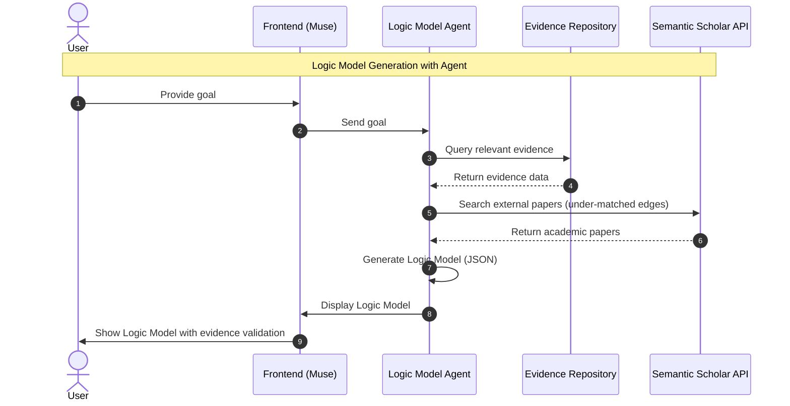
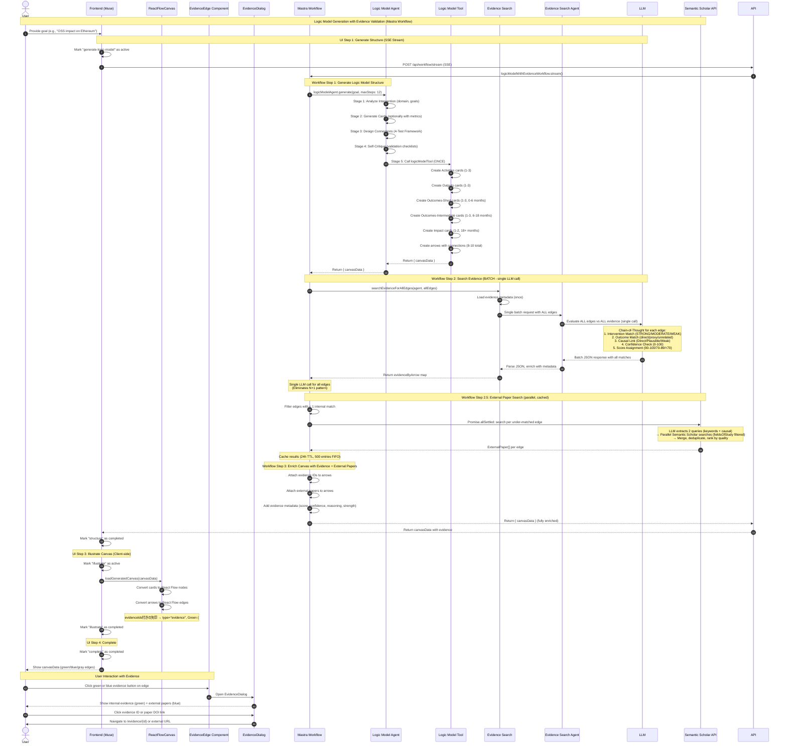

# Mastra Agent System

This document details the AI-powered agent system using the Mastra framework for logic model generation and evidence validation.

## Workflow Diagrams

### High-Level Workflow


```mermaid
sequenceDiagram
    autonumber
    actor User as User
    participant FE as Frontend (Muse)
    participant Agent as Logic Model Agent
    participant Evidence as Evidence Repository
    participant SS as Semantic Scholar API

    Note over User, SS: Logic Model Generation with Agent

    User->>FE: Provide goal
    FE->>Agent: Send goal
    Agent->>Evidence: Query relevant evidence
    Evidence-->>Agent: Return evidence data
    Agent->>SS: Search external papers (under-matched edges)
    SS-->>Agent: Return academic papers
    Agent->>Agent: Generate Logic Model (JSON)
    Agent->>FE: Display Logic Model
    FE->>User: Show Logic Model with evidence validation
```

### Detailed Workflow with Components


```mermaid
sequenceDiagram
    autonumber
    actor User as User
    participant FE as Frontend (Muse)
    participant Canvas as ReactFlowCanvas
    participant Edge as EvidenceEdge Component
    participant Dialog as EvidenceDialog
    participant Workflow as Mastra Workflow
    participant Agent as Logic Model Agent
    participant Tool as Logic Model Tool
    participant Search as Evidence Search
    participant EvidenceAgent as Evidence Search Agent
    participant LLM
    participant SS as Semantic Scholar API

    Note over User, SS: Logic Model Generation with Evidence Validation (Mastra Workflow)

    User->>FE: Provide goal (e.g., "OSS impact on Ethereum")

    Note over FE, LLM: UI Step 1: Generate Structure (SSE Stream)
    FE->>FE: Mark "generate-logic-model" as active
    FE->>API: POST /api/workflow/stream (SSE)
    API->>Workflow: logicModelWithEvidenceWorkflow.stream()

    Note over Workflow, Agent: Workflow Step 1: Generate Logic Model Structure
    Workflow->>Agent: logicModelAgent.generate(goal, maxSteps: 12)
    Agent->>Agent: Stage 1: Analyze Intervention (domain, goals)
    Agent->>Agent: Stage 2: Generate Cards (optionally with metrics)
    Agent->>Agent: Stage 3: Design Connections (4-Test Framework)
    Agent->>Agent: Stage 4: Self-Critique (validation checklists)
    Agent->>Tool: Stage 5: Call logicModelTool (ONCE)
    Tool->>Tool: Create Activities cards (1-3)
    Tool->>Tool: Create Outputs cards (1-3)
    Tool->>Tool: Create Outcomes-Short cards (1-3, 0-6 months)
    Tool->>Tool: Create Outcomes-Intermediate cards (1-3, 6-18 months)
    Tool->>Tool: Create Impact cards (1-2, 18+ months)
    Tool->>Tool: Create arrows with connections (8-10 total)
    Tool-->>Agent: Return { canvasData }
    Agent-->>Workflow: Return { canvasData }

    Note over Workflow, LLM: Workflow Step 2: Search Evidence (BATCH - single LLM call)
    Workflow->>Search: searchEvidenceForAllEdges(agent, allEdges)
    Search->>Search: Load evidence metadata (once)
    Search->>EvidenceAgent: Single batch request with ALL edges
    EvidenceAgent->>LLM: Evaluate ALL edges vs ALL evidence (single call)
    Note over LLM: Chain-of-Thought for each edge:<br/>1. Intervention Match (STRONG/MODERATE/WEAK)<br/>2. Outcome Match (direct/proxy/unrelated)<br/>3. Causal Link (Direct/Plausible/Weak)<br/>4. Confidence Check (0-100)<br/>5. Score Assignment (90-100/70-89/<70)
    LLM-->>EvidenceAgent: Batch JSON response with all matches
    EvidenceAgent-->>Search: Parse JSON, enrich with metadata
    Search-->>Workflow: Return evidenceByArrow map
    Note over Workflow: Single LLM call for all edges<br/>(Eliminates N+1 pattern)

    Note over Workflow, SS: Workflow Step 2.5: External Paper Search (parallel, cached)
    Workflow->>Workflow: Filter edges with < 1 internal match
    Workflow->>SS: Promise.allSettled: search per under-matched edge
    Note over SS: LLM extracts 2 queries (keywords + causal)<br/>→ Parallel Semantic Scholar searches (fieldsOfStudy filtered)<br/>→ Merge, deduplicate, rank by quality
    SS-->>Workflow: ExternalPaper[] per edge
    Note over Workflow: Cache results (24h TTL, 500 entries FIFO)

    Note over Workflow: Workflow Step 3: Enrich Canvas with Evidence + External Papers
    Workflow->>Workflow: Attach evidence IDs to arrows
    Workflow->>Workflow: Attach external papers to arrows
    Workflow->>Workflow: Add evidence metadata (score, confidence, reasoning, strength)
    Workflow-->>API: Return { canvasData } (fully enriched)
    API-->>FE: Return canvasData with evidence
    FE->>FE: Mark "structure" as completed

    Note over FE: UI Step 3: Illustrate Canvas (Client-side)
    FE->>FE: Mark "illustrate" as active
    FE->>Canvas: loadGeneratedCanvas(canvasData)
    Canvas->>Canvas: Convert cards to React Flow nodes
    Canvas->>Canvas: Convert arrows to React Flow edges
    Note over Canvas: evidenceIds付きの矢印 → type="evidence", Green (#10b981)<br/>externalPapers only → type="evidence", Blue (#3b82f6)<br/>Neither → default, Gray (#6b7280)
    FE->>FE: Mark "illustrate" as completed

    Note over FE: UI Step 4: Complete
    FE->>FE: Mark "complete" as completed
    FE-->>User: Show canvasData (green/blue/gray edges)

    Note over User, Edge: User Interaction with Evidence
    User->>Edge: Click green or blue evidence button on edge
    Edge->>Dialog: Open EvidenceDialog
    Dialog-->>User: Show internal evidence (green) + external papers (blue)
    User->>Dialog: Click evidence ID or paper DOI link
    Dialog->>User: Navigate to /evidence/{id} or external URL
```

## Architecture Overview

The application uses Mastra to orchestrate AI-powered logic model generation with evidence validation.

### Core Components

- **`mastra/workflows/`** - Multi-step workflows that coordinate agent execution
- **`mastra/agents/`** - LLM-powered agents (e.g., Logic Model Agent)
- **`mastra/tools/`** - Custom tools agents can use (e.g., Evidence Search Tool)
- **`mastra/skills/`** - Agent Skills ([spec](https://agentskills.io/specification)) providing structured instructions dynamically activated by agents via Workspace Skills API

## Logic Model Generation Workflow

### Step 1: Structure Generation

**Input** — one of:

- `goal`: free-text user goal (e.g., "Improve student literacy through school library programs"), or
- `fileInput`: base64-encoded PDF / image (`application/pdf`, `image/png`,
  `image/jpeg`, `image/webp`) with `mediaType` and optional `fileName`.
  The file is forwarded to Gemini 2.5 Pro as native multimodal content
  (no PDF parser or OCR step on our side). Used by the "From file" tab of
  the Generate Logic Model dialog; the HTTP contract lives in
  [api-routes.md § File upload path](./api-routes.md#file-upload-path).

When `fileInput` is present, the Logic Model Agent is instructed to treat
the attached document as the author's proposal and reconstruct their
stated theory of change faithfully — preserving the intended causal chain
without inventing or "fixing" missing links. The agent then runs the same
5-stage workflow described below.

**Process**:

- Agent analyzes goal text or attached document
- Generates logic model structure with:
  - **Cards**: Representing stages (activities, outputs, outcomes, impact)
  - **Arrows**: Representing causal relationships ("if X, then Y")

**Output**: `CanvasData` with cards and arrows (no evidence yet)

### Step 2: Batch Evidence Search

**Critical Feature**: Single LLM call for all arrows (not parallel execution - eliminates N+1 pattern)

**Process**:

1. Collect all arrows from generated logic model
2. Format as batch input for LLM:
   ```json
   {
     "arrows": [
       {"id": "arrow1", "source": "After-school tutoring", "target": "Improved math scores"},
       {"id": "arrow2", "source": "Teacher training", "target": "Better instruction quality"}
     ],
     "evidence_library": [...all available evidence...]
   }
   ```
3. Single LLM call evaluates all arrows at once
4. LLM returns batch results with match scores, reasoning, and evidence IDs

**LLM Model**: `google/gemini-2.5-pro` (configured in `lib/evidence-search-batch.ts`)

**Matching Criteria**:

- Evidence intervention semantically aligns with arrow source
- Evidence outcome semantically aligns with arrow target
- Match score ≥ 70 threshold for inclusion

**Output Format**:

```typescript
{
  arrowId: string,
  matchedEvidenceId: string | null,
  score: number,        // 0-100
  confidence: string,   // "high" | "medium" | "low"
  reasoning: string,    // Chain-of-thought explanation
  strength: number      // Evidence strength (0-5)
}
```

### Step 2.5: External Academic Paper Search

**Trigger condition**: Only runs when `EXTERNAL_SEARCH_ENABLED=true`. Searches edges with fewer than `MIN_INTERNAL_MATCHES_BEFORE_EXTERNAL` (1) internal evidence matches. Also enabled by default in the compact API (`/api/compact`).

**Process**:

1. Filter arrows to those with insufficient internal evidence
2. For each under-matched edge (parallel via `Promise.allSettled`):
   a. Extract card titles and descriptions from source/target content
   b. Use Gemini 2.5 Flash to generate **two complementary search queries**:
   - `keywords`: 3-5 English academic keywords covering core concepts
   - `causal`: Natural-language causal relationship phrase (e.g., "effect of X on Y")
     c. Run both queries in parallel against Semantic Scholar Graph API with `fieldsOfStudy` filter (Medicine, Sociology, Economics, Education, Environmental Science, Political Science, Psychology) and `publicationTypes` filter (JournalArticle, Review, CaseReport)
     d. If filtered results are too few, fall back to unfiltered search
     e. Merge results, deduplicate by DOI/title, rank by quality score
3. Cache results with 24h TTL (in-memory, 500-entry FIFO)

**Quality Ranking**: Papers are scored and sorted by:

- Influential citation count (×3 weight, log scale)
- Citation count (log scale, fallback when no influential citations)
- Has abstract or TLDR (+2)
- Published 2020 or later (+1)

**Key Design Decisions**:

- **Multi-query strategy**: Two queries from different angles improve recall; merged results improve precision via quality ranking
- **fieldsOfStudy filter**: Prioritizes DPG/EBP-relevant fields with automatic fallback to avoid zero results
- **LLM query extraction**: Card titles and descriptions may be non-English or domain-specific; Gemini 2.5 Flash generates structured queries with graceful fallback to raw titles
- **Parallel execution**: `Promise.allSettled` ensures one failing edge search doesn't block others
- **Caching**: Deterministic cache key from edge content avoids redundant LLM + API calls
- **No scoring**: External papers are presented as reference material only (no LLM relevance scoring)

**Error Handling**: Semantic Scholar API errors are differentiated by HTTP status code:

- **429 (Rate Limit)**: Warning logged with suggestion to reduce concurrency or add API key
- **5xx (Server Error)**: Warning logged with status code
- **Other client errors**: Debug-level logging only
- All errors result in empty results (graceful degradation — never blocks the workflow)

**Output**: `Record<arrowId, ExternalPaper[]>` map (max 3 papers per edge, ranked by quality)

### Step 3: Result Merging

**Process**:

- Results from batch evidence search merged into canvas data
- Arrows with matches (score ≥ 70) get `evidenceIds` populated
- Evidence metadata attached to arrows
- External papers from Step 2.5 attached to arrows as `externalPapers: ExternalPaper[]`
  ```typescript
  {
    ...arrow,
    evidenceIds: ["ev_001"],
    evidenceScore: 85,
    evidenceReasoning: "Strong alignment between tutoring intervention and math outcomes",
    evidenceStrength: 5,
    externalPapers: [
      {
        id: "ext-semantic_scholar-a1b2c3d4",
        title: "Effects of Tutoring on Mathematics Achievement",
        authors: ["Smith, J.", "Jones, K."],
        year: 2022,
        doi: "10.1234/example",
        source: "semantic_scholar",
        tldr: "Tutoring significantly improves math outcomes...",
        influentialCitationCount: 5,
        fieldsOfStudy: ["Education", "Psychology"],
        publicationVenue: "Journal of Educational Psychology"
      }
    ]
  }
  ```

**Output**: Complete `CanvasData` with evidence-backed arrows and external papers

## Agent Architecture & Quality Controls

The system uses two specialized AI agents with comprehensive quality controls:

### 1. Logic Model Agent

**Location**: `mastra/agents/logic-model-agent.ts`

Theory of Change specialist with structured 5-stage workflow:

#### Stage 1: Analyze Intervention

- Domain analysis (tech, education, health, civic)
- Target population identification
- Goal assessment and reference interventions

#### Stage 2: Generate Cards

- Creates 1-2 cards per stage with title (max 100 chars), description (max 200 chars), and optionally metrics
- Stages: Activities → Outputs → Outcomes-Short (0-6 months) → Outcomes-Intermediate (6-18 months) → Impact (18+ months)
- When `enableMetrics` is true, each card includes 1 metric object with name, measurementMethod, and frequency fields. When disabled (default), metrics arrays are empty.

#### Stage 3: Design Connections with 4-Test Framework

- **Directness Test**: Clear, immediate causal path (1-2 steps)
- **Expert Test**: Would domain experts agree this is plausible?
- **Timeframe Test**: Outcome achievable within stage timeframe?
- **Mechanism Test**: Can you articulate how X causes Y?
- Connection boundaries: 8-10 ideal, 25 absolute maximum
- Per-card limits: 1-2 outgoing connections (3 max)

#### Stage 4: Self-Critique

- **Format Validation Checklist**: targetContext as string, metrics as objects, character limits
- **Logic Validation Checklist**: No stage-leaping, realistic timeframes, no circular dependencies
- **Metacognitive Questions**: "Would an expert find this questionable?", "Am I being overly optimistic?", "Did I inflate connection count?"

#### Stage 5: Call Tool

- Generates canvas with validated structure
- Tool must be called (maxSteps: 12, allowing skill activation steps)

### Common Mistakes Prevention

- ❌ **TOP MISTAKE #1**: targetContext as object instead of string
- ❌ **TOP MISTAKE #2**: Metrics as strings instead of objects (when metrics enabled)
- ❌ **TOP MISTAKE #3**: Too many (>15) or too few (<8) connections
- ❌ **TOP MISTAKE #4**: Weak/indirect connections to hit count
- ❌ **TOP MISTAKE #5**: Invalid frequency values (when metrics enabled)

### 2. Evidence Search Agent

**Location**: `mastra/agents/evidence-search-agent.ts`

LLM-based evidence matching with chain-of-thought reasoning:

- **Batch Mode**: Evaluates ALL edges in single LLM call
- **Structured Reasoning** (5 sub-stages):
  1. **Intervention Match Analysis**: Rate alignment (STRONG/MODERATE/WEAK/NONE)
  2. **Outcome Match Analysis**: Direct measure, proxy measure, or unrelated
  3. **Causal Link Assessment**: Direct, Plausible, Weak, or No connection
  4. **Confidence Check**: 0-100 certainty with alternative interpretations
  5. **Final Score Assignment**: 90-100 (STRONG), 70-89 (MODERATE), <70 (excluded)

### Scoring Calibration Examples

- **Score 95 (STRONG)**: Same concepts, direct causal link, high confidence
- **Score 75 (MODERATE)**: Related concepts, plausible causal link, moderate confidence
- **Score 60 (WEAK - excluded)**: Indirect or weak connection, low confidence

### Borderline Handling (65-75)

- Re-evaluate using more conservative criteria
- Ask: Would a domain expert agree?
- Check confidence: If <60, consider excluding
- When in doubt, err on side of excluding
- Document uncertainty in reasoning

### Evidence Search Output Format

```json
{
  "results": {
    "arrowId1": [
      {
        "evidenceId": "00",
        "score": 95,
        "confidence": 90,
        "reasoning": "Intervention Match: STRONG - ...",
        "interventionText": "...",
        "outcomeText": "..."
      }
    ]
  }
}
```

### Verification Checklist

- ✓ All arrowIds present (even if empty arrays)
- ✓ Only matches with score ≥ 70 included
- ✓ All 6 required fields present: evidenceId, score, confidence, reasoning, interventionText, outcomeText
- ✓ Reasoning follows structured format
- ✓ Confidence values populated (0-100)
- ✓ JSON format matches schema exactly

### 3. Supporting Agents

These lighter-weight agents handle specific subtasks invoked by the primary
workflow or by API routes. They intentionally use a faster model
(`FLASH_MODEL`, defaults to `google/gemini-2.5-flash`) since the tasks are
narrow transformations, not reasoning.

#### Conversation Bot Agent

**Location**: `mastra/agents/conversation-bot-agent.ts`

Natural-language assistant for evidence exploration. Loads the full internal
evidence library via `get-all-evidence-tool` and answers user queries using
the `evidence-matching` and `evidence-presentation` skills.

- **Used by**: `app/api/evidence/search` (conversational evidence search)
- **Language policy**: Responds in the user's input language
- **External papers**: Distinguishes internal (attested, SMS-rated) from
  Semantic Scholar external papers in the response

#### Keyword Extraction Agent

**Location**: `mastra/agents/keyword-extraction-agent.ts`

Converts a logic-model edge (`From` → `To`) into two complementary English
search queries (`keywords` + `causal`) for Semantic Scholar lookups. Returns
strict JSON.

- **Used by**: `lib/academic-apis/extract-search-keywords.ts` (invoked inside
  the Step 2.5 External Paper Search)
- **Model**: `FLASH_MODEL`

#### Query Translation Agent

**Location**: `mastra/agents/query-translation-agent.ts`

Translates non-English search queries into English academic keywords before
they hit Semantic Scholar. Pure translation — no reasoning.

- **Used by**: `lib/external-paper-search.ts` (`translateToEnglishQuery()`)
- **Model**: `FLASH_MODEL`

### Output Language Handling

Since commit `31081da`, logic-model cards and evidence-search reasoning are
emitted in the language of the user's input (`goal` text for logic models,
edge `fromText`/`toText` for evidence matching). Implementation details:

- The rule lives in **both** agent instructions and the activated skill
  (`mastra/skills/logic-model-generation/SKILL.md`,
  `mastra/skills/evidence-matching/SKILL.md`) so it applies before and after
  skill activation.
- Structured labels (`STRONG` / `MODERATE` / `WEAK` / `NONE`, `Direct` /
  `Plausible` / `Weak`, Maryland SMS levels) stay in **English** to keep
  downstream parsing stable.
- `interventionText` / `outcomeText` are copied verbatim from source
  evidence — never translated.
- For external paper search, `query-translation-agent` is the source of
  truth for detecting non-English input and translating to English before
  Semantic Scholar lookup.

## Core Components

### GenerateLogicModelDialog.tsx

**Location**: `components/canvas/GenerateLogicModelDialog.tsx`

Main UI component with 4-step process:

- Step 1: "generate-logic-model" - Generates logic model structure via SSE stream
- Step 2: "search-evidence" - Searches for supporting evidence
- Step 3: "enrich-canvas" - Enriches canvas with evidence metadata
- Step 4: "complete" - Final state
- Real-time step progress via `useWorkflowStream` hook and SSE route (`/api/workflow/stream`)
- Form validation with Zod

**Input modes (shadcn `Tabs`)**:

- **Goal**: free-text prompt; posts JSON to `/api/workflow/stream`.
- **From file**: drag-and-drop dropzone for a PDF or image (PNG / JPEG /
  WebP, ≤4 MB). Client-side validation mirrors the server whitelist /
  size ceiling from `lib/constants.ts` with i18n error messages. The
  selected file is previewed before submit and posted as
  `multipart/form-data`. Switching to this tab flips
  `enableExternalSearch` to the `EXTERNAL_SEARCH_ENABLED` flag value
  (effectively ON when the flag is enabled) because evidence-gap
  detection is the primary value for proposals that may lack citations.

`useWorkflowStream.startWorkflow` accepts a discriminated union
(`{ kind: "goal", goal }` or `{ kind: "file", file }`) and picks the
JSON vs `FormData` transport accordingly.

- Collapsible "Options" section with:
  - `enableExternalSearch` toggle (visible when `EXTERNAL_SEARCH_ENABLED=true`)
  - `enableMetrics` toggle (default OFF) — controls whether the agent generates metrics for cards

### logic-model-with-evidence.ts

**Location**: `mastra/workflows/logic-model-with-evidence.ts`

Production workflow with 4 steps (including Step 2.5):

**Step 1: Generate Logic Model Structure**

- Reads `enableMetrics` from workflow init data (default: false)
- Conditionally instructs agent to generate or skip metrics
- Validates agent called logicModelTool and returned valid canvas data with detailed logging
- Extracts canvasData from tool results with detailed logging

**Step 2: Batch Evidence Search**

- Maps card IDs to content for quick lookup
- Prepares all edges for batch processing (filters invalid arrows)
- Single batch call to `searchEvidenceForAllEdges`
- Ensures all arrows have evidence entries (empty arrays if no matches)

**Step 2.5: External Academic Paper Search**

- Checks `EXTERNAL_SEARCH_ENABLED` flag; skips if disabled
- Filters edges to those with fewer than `MIN_INTERNAL_MATCHES_BEFORE_EXTERNAL` internal matches
- Parallel search across all under-matched edges via `Promise.allSettled`
- Each edge: LLM extracts 2 queries (keywords + causal) → parallel Semantic Scholar searches (fieldsOfStudy filtered + fallback) → merge + deduplicate + quality ranking
- Returns `Record<arrowId, ExternalPaper[]>` map (ranked by quality)

**Step 3: Enrich Canvas with Evidence + External Papers**

- Maps evidence matches to arrow IDs
- Attaches evidenceIds and evidenceMetadata to arrows
- Attaches externalPapers to arrows
- Returns enriched canvas data

Returns simplified output: `{ canvasData }` (stats derived from data, no separate tracking)
Comprehensive logging with module prefix and detailed debug info

### evidence-search-batch.ts

**Location**: `lib/evidence-search-batch.ts`

Batch evidence search function:

- Single LLM call for all edges (eliminates N+1 pattern)
- Loads evidence metadata once, enriches all matches
- Returns `Record<arrowId, EvidenceMatch[]>` map
- Error handling returns empty results for all edges on failure

### logic-model-tool.ts

**Location**: `mastra/tools/logic-model-tool.ts`

Tool for generating logic model structure:

- Validates input format (targetContext, metrics, connections)
- Generates canvas layout with positioning
- Returns CanvasData conforming to schema

### Type Definitions

**Location**: `types/index.ts`

- Arrow type extended with `evidenceIds: string[]`, `evidenceMetadata: EvidenceMatch[]`, and `externalPapers: ExternalPaper[]`
- EvidenceMatch interface with evidenceId, score, confidence, reasoning, strength, hasWarning, title, interventionText, outcomeText
- ExternalPaper interface with id, title, authors, year, doi, url, abstract, source, citationCount, tldr, influentialCitationCount, fieldsOfStudy, publicationVenue
- EvidenceSearchRequest extended with `includeExternalPapers: boolean` option
- EvidenceSearchResponse extended with optional `externalPapers: ExternalPaper[]`
- CanvasDataSchema reused throughout for validation

### Architecture Benefits

- **Separation of Concerns**: Structure generation isolated from evidence search (3 distinct workflow steps)
- **Step-by-Step UI**: Users see clear progress through 4 UI steps (analyze → structure → illustrate → complete)
- **Batch Processing**: Single LLM call evaluates all edges, eliminating N+1 pattern
- **Fast Model**: Uses `google/gemini-2.5-pro` for high-quality LLM evaluation with tool calling support
- **Structured Agent Instructions**: 5-stage workflow with validation checklists and metacognitive questions for quality assurance
- **Connection Quality Framework**: 4-Test validation (Directness, Expert, Timeframe, Mechanism) ensures only strong causal links
- **Chain-of-Thought Reasoning**: Evidence search uses structured analysis for transparent decision-making
- **Simplified API**: Returns just CanvasData, consumers calculate stats as needed (no duplicate tracking)
- **Production-ready Logging**: Detailed progress logs with module prefix and comprehensive debug info
- **Schema Reuse**: 100% reuse of types from `types/index.ts` (CanvasDataSchema, EvidenceMatchSchema, etc.)
- **Transparent Evidence Search**: Evidence search happens invisibly during structure step, no separate UI loading state
- **Better Error Recovery**: Explicit validation of tool call results with detailed logging aids debugging
- **Observability**: Comprehensive logging with structured reasoning makes agent decisions explainable
- **Graceful External Search**: External paper search runs only for under-matched edges, uses parallel execution with fault isolation (`Promise.allSettled`), and caches aggressively (24h TTL)

### Compact API Endpoint

**Location**: `app/api/compact/route.ts`

`POST /api/compact` — Converts chat history into a Logic Model with evidence.

**Pipeline**:

1. Authenticate via `BOT_API_KEY` header (optional, skipped if `BOT_API_KEY` env var is not configured)
2. Validate request body with `CompactRequestSchema` (`chatHistory: ChatMessage[]`)
3. Extract goal from user messages in the conversation
4. Run `logicModelWithEvidenceWorkflow` with `enableExternalSearch: true` and `enableMetrics: false` (default)
5. Validate output with `CanvasDataSchema`
6. Upload canvas data to IPFS via Pinata
7. Return `CompactResponse`: `{ canvasUrl, canvasId, summary: { extractedIssues, intervention, targetContext } }`

**Error Handling**:

- `400`: Invalid request body
- `413`: Payload too large
- `504`: Workflow timeout (`WORKFLOW_TIMEOUT_MS`)
- `500`: Workflow failure or canvas data validation error

**Configuration**: `maxDuration = 300` (Vercel serverless timeout, seconds)

## UI Flow (4 Steps)

1. **Analyze Goal or File** (UI only)
   - Marks step as active → completed immediately
   - No server interaction
   - Both input modes (text `goal` and uploaded `fileInput`) feed into the
     same server workflow — only Workflow Step 1 branches on the input;
     Steps 2 / 2.5 / 3 are identical.

2. **Generate Structure** (Server) - **Full workflow executes here**:
   - Workflow Step 1: LLM generates cards and arrows with 5-stage validation
   - Workflow Step 2: Batch evidence search - single LLM call with chain-of-thought for all edges
   - Workflow Step 2.5: External academic paper search for under-matched edges (multi-query Semantic Scholar API with fieldsOfStudy filter)
   - Workflow Step 3: Enrich arrows with evidence metadata + external papers
   - Returns complete `CanvasData` to frontend

3. **Illustrate Canvas** (Client)
   - Renders canvasData with React Flow
   - Applies evidence styling to edges
   - Converts internal format to React Flow format

4. **Complete** (UI)
   - Displays final logic model
   - Green edges for evidence-backed arrows, blue edges for external papers only
   - Interactive evidence buttons on edges (green FileText / blue BookOpen)

## Evidence Search Implementation

### Semantic Matching with LLM

**Location**: `lib/evidence-search-batch.ts`

**Key Features**:

1. **Batch Processing**: Single LLM call evaluates all arrows together
   - Avoids N+1 query problem
   - More efficient token usage
   - Consistent evaluation criteria across all arrows

2. **Chain-of-Thought Analysis**: LLM provides reasoning for each match
   - Explains alignment between intervention and outcome
   - Notes strength of evidence
   - Identifies gaps or weaknesses

3. **Match Scoring**:
   - **90-100**: Highly specific match (exact intervention and outcome)
   - **70-89**: Good alignment (similar concepts, clear relationship)
   - **50-69**: Moderate alignment (related but not exact)
   - **0-49**: Weak or no alignment (not displayed)

### Evidence Search Tool

Custom Mastra tool that agents can invoke to search evidence library.

**Tool Definition**:

```typescript
{
  name: "searchEvidence",
  description: "Search evidence library for research supporting causal relationships",
  inputSchema: {
    arrows: "Array of arrow objects with source and target",
    threshold: "Minimum match score (default: 70)"
  }
}
```

**Implementation**:

- Loads all evidence from `@beaconlabs-io/evidence/content`
- Pre-parsed frontmatter metadata from bundled content
- Formats for LLM consumption
- Handles batch processing logic

## Display Integration

### Canvas Visualization

Arrows display with color coding based on their evidence status:

- **Green thick edges** (#10b981, 3px) - Has internal attested evidence (green FileText button)
- **Blue thick edges** (#3b82f6, 3px) - Has external papers only, no internal evidence (blue BookOpen button)
- **Gray default edges** (#6b7280, 2px) - No evidence or external papers (no button)

Evidence dialog shows two sections:

- **Internal Evidence** (green theme): Attested evidence with score, reasoning, strength, and link to `/evidence/{id}`
- **Academic Papers (Reference)** (blue theme): External papers with title, authors, year, DOI, abstract, and citation count

### Evidence Detail Page

Each evidence item has dedicated page at `/evidence/{id}`:

- Full MDX content rendering
- Metadata display (strength, methodologies, citation)
- Attestation information (blockchain UID, IPFS link)
- Related logic models using this evidence

## Design Patterns

### Batch Processing

**Why**: Avoid N+1 query anti-pattern common in AI agent systems

**How**: Collect all arrows, format as single prompt, parse batch response

**Benefits**:

- Reduced latency (1 LLM call vs N calls)
- Lower cost (fewer API requests)
- Consistent evaluation criteria
- Better token efficiency

### Tool Design Principles

1. **Descriptive input schemas**: Clear parameter names and descriptions
2. **Token-efficient returns**: Only return necessary information
3. **Unambiguous outputs**: Structured JSON, not prose
4. **Minimal functional overlap**: Each tool has clear, distinct purpose

### Agent Skills (Workspace Skills API)

**Location**: `mastra/skills/`

Skills follow the [Agent Skills specification](https://agentskills.io/specification) with YAML frontmatter (`name`, `description`, `version`, `tags`) and Markdown body. Skills are managed through Mastra's Workspace Skills API:

1. **Workspace Configuration** (`mastra/index.ts`): `Workspace({ skills: ["/mastra/skills"] })` registers skill directories
2. **SkillsProcessor**: Mastra automatically creates a processor that injects available skills into agent system messages
3. **Dynamic Activation**: Agents activate skills during conversation via the `skill-activate` tool provided by SkillsProcessor
4. **Reference Access**: Agents read supporting docs via `skill-read-reference` tool from `references/` directory

**Skills**:

- **`logic-model-generation/SKILL.md`** - Causal reasoning methodology, Sphere of Control/Influence/Interest
  - `references/causal-reasoning.md` - Connection evaluation, mechanism test, failure patterns
  - `references/stage-definitions.md` - Stage definitions, boundary tests, examples
  - `references/format-requirements.md` - Format rules, connection patterns, field limits
  - `references/common-mistakes.md` - Top 5 error patterns and fixes
- **`evidence-matching/SKILL.md`** - Evidence-to-intervention matching methodology: chain-of-thought scoring, STRONG/MODERATE/WEAK/NONE labels, borderline handling. Activated by the Evidence Search Agent during batch matching.
- **`evidence-presentation/SKILL.md`** - Evidence presentation methodology: Maryland Scientific Methods Scale explanations, citation formatting, accessible-language summaries. Activated by the Conversation Bot Agent when presenting results.

### Agent Instructions

Agents receive:

- **Base instructions**: Role description and skill activation guidance (in agent constructor)
- **Skill instructions**: Dynamically injected when agent activates a skill via `skill-activate` tool
- **Skill references**: On-demand access to detailed docs via `skill-read-reference` tool
- **Available tools**: Tools they can invoke
- **Output format**: Expected structure of response

## Development Commands

**Start Mastra dev server**:

```bash
bun dev:mastra
```

- Starts Mastra development server for testing agents/workflows

**Build Mastra system**:

```bash
bun build:mastra
```

- Compiles Mastra agent system
- Validates tool schemas and agent configurations

## File References

### Workflows

- `mastra/workflows/logic-model-with-evidence.ts` - Production workflow with 4 steps (including Step 2.5)

### Agents

- `mastra/agents/logic-model-agent.ts` - Logic model generation agent (5-stage workflow)
- `mastra/agents/evidence-search-agent.ts` - Evidence matching agent (chain-of-thought)
- `mastra/agents/conversation-bot-agent.ts` - Conversational evidence search (used by `/api/evidence/search`)
- `mastra/agents/keyword-extraction-agent.ts` - Semantic Scholar query extraction from edge text
- `mastra/agents/query-translation-agent.ts` - Non-English → English query translation

### Tools

- `mastra/tools/logic-model-tool.ts` - Logic model structure generation tool
- `mastra/tools/get-all-evidence-tool.ts` - Loads the full internal evidence library for batch matching
- `lib/evidence-search-batch.ts` - Batch evidence matching (single LLM call for all arrows)
- `lib/external-paper-search.ts` - External paper search orchestration with caching
- `lib/academic-apis/semantic-scholar.ts` - Semantic Scholar Graph API client
- `lib/academic-apis/extract-search-keywords.ts` - Gemini 2.5 Flash keyword extraction

### Components

- `components/canvas/GenerateLogicModelDialog.tsx` - UI with 4-step process
- `app/api/workflow/stream/route.ts` - SSE route handler for workflow streaming
- `hooks/useWorkflowStream.ts` - Client hook for consuming SSE events

### Skills

- `mastra/skills/logic-model-generation/SKILL.md` - Logic model generation skill (Agent Skills spec)
- `mastra/skills/logic-model-generation/references/causal-reasoning.md` - Connection evaluation and failure patterns
- `mastra/skills/evidence-matching/SKILL.md` - Evidence matching methodology (scoring, language policy)
- `mastra/skills/evidence-presentation/SKILL.md` - Evidence presentation methodology (Maryland SMS, citations)
- `mastra/skills/logic-model-generation/references/stage-definitions.md` - Stage definitions and boundary tests
- `mastra/skills/logic-model-generation/references/format-requirements.md` - Format rules and connection patterns
- `mastra/skills/logic-model-generation/references/common-mistakes.md` - Top 5 error patterns

### Configuration

- `mastra/index.ts` - Mastra framework initialization (storage, workspace with skills, processors)
- `lib/evidence.ts` - Evidence loading with MDX compilation

### Types

- `types/index.ts` - CanvasData, Arrow, Card, EvidenceMatch, ExternalPaper interfaces

## Observability & Tracing

The application uses Mastra's built-in observability for distributed tracing of agent and workflow executions.

### What is Automatically Traced

- **Agent executions**: Each `agent.generate()` call, including LLM interactions and token usage
- **Tool invocations**: `logicModelTool`, `getAllEvidenceTool` execution times and results
- **Workflow steps**: `generateLogicModelStep`, `searchEvidenceStep`, `enrichCanvasStep` execution
- **LLM parameters**: Model name, token counts (input/output), latency per LLM call

### Configuration

Observability is configured in `mastra/index.ts` with environment-based settings:

| Environment | Sampling           | Exporters                  |
| ----------- | ------------------ | -------------------------- |
| Development | 100% (`ALWAYS`)    | DefaultExporter (local DB) |
| Production  | 10% (`RATIO: 0.1`) | DefaultExporter (local DB) |

Both environments include `SensitiveDataFilter` for data privacy.

### Viewing Traces

**Mastra Studio:**

```bash
bun dev:mastra
# Open Mastra Studio at http://localhost:4111
# Navigate to Traces tab to see agent/workflow executions
```

Traces are stored locally in LibSQL (`mastra.db`) via `DefaultExporter` and viewed through Mastra Studio.

### Environment Variables

| Variable                              | Required | Description                                                  |
| ------------------------------------- | -------- | ------------------------------------------------------------ |
| `MASTRA_STORAGE_URL`                  | No       | LibSQL storage URL (default: `file:./mastra.db`)             |
| `SEMANTIC_SCHOLAR_API_KEY`            | No       | Semantic Scholar API key for higher rate limits (optional)   |
| `NEXT_PUBLIC_EXTERNAL_SEARCH_ENABLED` | No       | Set to `true` to show external paper search toggle in the UI |

### Relationship with lib/logger.ts

The custom logger (`lib/logger.ts`) and Mastra observability serve complementary purposes:

- **`lib/logger.ts`**: Application-level logging (console output, structured messages for debugging)
- **Mastra Observability**: Distributed tracing (spans, trace context, LLM token tracking, Mastra Studio)

Both coexist without interference.

## Future Enhancements

Potential improvements to the Mastra system:

- **Caching**: External paper search now uses in-memory cache (24h TTL, 500 entries FIFO). Internal evidence search could benefit from similar caching
- **Incremental updates**: Support adding/removing individual arrows without full regeneration
- **Multi-agent collaboration**: Specialized agents for different logic model stages
- **User feedback loop**: Incorporate user corrections to improve matching accuracy
